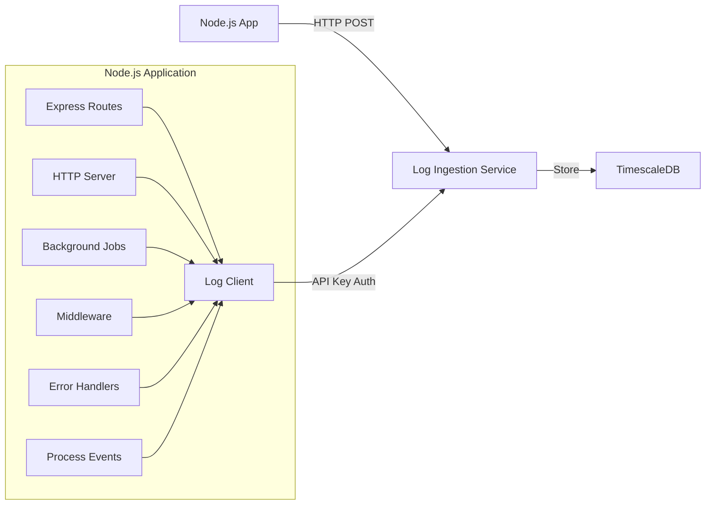

# Node.js Integration Guide

This guide provides comprehensive instructions for integrating the Log Ingestion Service into a Node.js application using the `@cmdquery/log-ingestion-next` package from GitHub Packages.

## Table of Contents

- [Overview](#overview)
- [Prerequisites](#prerequisites)
- [Localhost Setup](#localhost-setup)
- [Production Setup](#production-setup)
- [Integration Implementation](#integration-implementation)
- [Code Examples](#code-examples)
- [Best Practices](#best-practices)
- [Troubleshooting](#troubleshooting)
- [Advanced Topics](#advanced-topics)

## Overview

The Log Ingestion Service is a high-performance HTTP service that collects, validates, and stores logs in TimescaleDB. This integration enables your Node.js application to send structured logs for centralized monitoring and analysis.

### Architecture



### What This Integration Provides

- **Structured Logging**: Send logs with consistent format (timestamp, level, service, message, metadata)
- **Request Logging**: Automatically log HTTP requests and responses via middleware
- **Error Logging**: Capture and log uncaught exceptions and unhandled rejections
- **Background Job Logging**: Log job execution, failures, and performance
- **Batch Processing**: Efficiently send multiple logs in a single request
- **Error Handling**: Automatic retry logic with exponential backoff
- **Rate Limiting**: Built-in handling for rate limit responses
- **Process Lifecycle**: Log application startup, shutdown, and health events

## Prerequisites

Before you begin, ensure you have:

- **Node.js** 18.0 or later (for native fetch support)
- **npm** or **yarn** package manager
- A **GitHub account** with access to the `@cmdquery/log-ingestion-next` package
- A **GitHub Personal Access Token** with `read:packages` permission
- An **API key** from the log ingestion service
- The **service URL** for your environment:
  - Localhost: `http://localhost:8080`
  - Production: Your production service URL (e.g., `https://cmdlog.tech`)

## Localhost Setup

### Step 1: Start the Log Ingestion Service

If you haven't already, start the log ingestion service locally:

```bash
# Navigate to the log ingestion service directory
cd /path/to/cmd-log

# Start TimescaleDB
make docker-up

# Run database migrations
make migrate

# Start the service
make run
```

The service will be available at `http://localhost:8080`.

### Step 2: Configure API Key

Set up an API key for local development. You can configure this via environment variables:

```bash
# In the log ingestion service directory
export LOG_INGESTION_API_KEYS="dev-api-key-12345"
```

Or add it to a `.env` file in the service directory.

### Step 3: Verify Service Health

Test that the service is running:

```bash
curl http://localhost:8080/health
```

You should receive: `{"status":"healthy"}`

### Step 4: Configure GitHub Packages Authentication

Since `@cmdquery/log-ingestion-next` is a private package on GitHub Packages, you need to authenticate:

#### Option 1: Using Environment Variable (Recommended)

1. **Create a GitHub Personal Access Token**:
   - Go to GitHub Settings → Developer settings → Personal access tokens → Tokens (classic)
   - Generate a new token with `read:packages` permission
   - Copy the token (starts with `ghp_`)

2. **Create or edit `.npmrc`** in your project root:

```ini
@cmdquery:registry=https://npm.pkg.github.com
//npm.pkg.github.com/:_authToken=${GITHUB_TOKEN}
```

3. **Set the environment variable**:

```bash
export GITHUB_TOKEN=ghp_your_token_here
```

Or add it to your `.env` file:

```bash
# .env
GITHUB_TOKEN=ghp_your_token_here
```

#### Option 2: Direct Token in .npmrc (Less Secure)

```ini
@cmdquery:registry=https://npm.pkg.github.com
//npm.pkg.github.com/:_authToken=ghp_your_token_here
```

**Important**: Never commit `.npmrc` with a token directly to version control. Use environment variables instead.

### Step 5: Install the Package

Install the log ingestion client package:

```bash
npm install @cmdquery/log-ingestion-next
```

Or with yarn:

```bash
yarn add @cmdquery/log-ingestion-next
```

### Step 6: Configure Environment Variables

Create a `.env` file in your Node.js project root:

```bash
# .env
LOG_INGESTION_URL=http://localhost:8080
LOG_INGESTION_API_KEY=dev-api-key-12345
LOG_INGESTION_SERVICE=nodejs-app
GITHUB_TOKEN=ghp_your_token_here
```

If you're using a `.env` file, make sure to load it with a package like `dotenv`:

```bash
npm install dotenv
```

```javascript
// At the top of your entry file (e.g., index.js or app.js)
require('dotenv').config();
```

### Step 7: Test the Connection

Create a test file to verify the integration:

```javascript
// test-logging.js
const { LogClient } = require('@cmdquery/log-ingestion-next');
require('dotenv').config();

const client = new LogClient({
  apiUrl: process.env.LOG_INGESTION_URL,
  apiKey: process.env.LOG_INGESTION_API_KEY,
  service: process.env.LOG_INGESTION_SERVICE || 'nodejs-app',
});

async function test() {
  try {
    await client.info('Test log from Node.js', { test: true });
    console.log('Log sent! Check your logs.');
    await client.destroy(); // Flush and cleanup
  } catch (error) {
    console.error('Error sending log:', error);
    process.exit(1);
  }
}

test();
```

Run it:

```bash
node test-logging.js
```

## Production Setup

### Step 1: Configure Environment Variables

Set environment variables in your production environment:

**For Heroku:**
```bash
heroku config:set LOG_INGESTION_URL=https://cmdlog.tech
heroku config:set LOG_INGESTION_API_KEY=your-production-api-key
heroku config:set LOG_INGESTION_SERVICE=nodejs-app
heroku config:set GITHUB_TOKEN=your_github_token
```

**For AWS/Other Platforms:**
Set the same environment variables through your platform's configuration interface or use a secrets management service.

### Step 2: Secure API Key Management

**Best Practices:**
- Use different API keys for different environments (dev, staging, production)
- Rotate API keys regularly
- Store API keys in secure secret management systems (AWS Secrets Manager, HashiCorp Vault, etc.)
- Never commit API keys or tokens to version control
- Use environment-specific configuration
- Store GitHub token securely (consider using CI/CD secrets for build-time access)

### Step 3: Verify Production Endpoint

Test your production endpoint:

```bash
curl https://cmdlog.tech/health
```

### Step 4: Configure CI/CD for Package Access

If you're building in CI/CD, configure GitHub token access:

**GitHub Actions:**
```yaml
- name: Setup Node.js
  uses: actions/setup-node@v3
  with:
    registry-url: 'https://npm.pkg.github.com'
    scope: '@cmdquery'
    
- name: Install dependencies
  run: npm install
  env:
    NODE_AUTH_TOKEN: ${{ secrets.GITHUB_TOKEN }}
```

**Other CI/CD:**
Set the `GITHUB_TOKEN` environment variable in your CI/CD platform's secrets configuration.

## Integration Implementation

### Basic Client Setup

Create a singleton log client instance:

```typescript
// lib/logging/client.ts
import { LogClient } from '@cmdquery/log-ingestion-next';

let clientInstance: LogClient | null = null;

export function getLogClient(): LogClient {
  if (!clientInstance) {
    const apiUrl = process.env.LOG_INGESTION_URL;
    const apiKey = process.env.LOG_INGESTION_API_KEY;
    const service = process.env.LOG_INGESTION_SERVICE || 'nodejs-app';

    if (!apiUrl || !apiKey) {
      console.warn(
        'Log ingestion not configured. Set LOG_INGESTION_URL and LOG_INGESTION_API_KEY'
      );
      // Return a no-op client
      return {
        log: async () => {},
        debug: async () => {},
        info: async () => {},
        warn: async () => {},
        error: async () => {},
        fatal: async () => {},
        flush: async () => {},
        destroy: async () => {},
      } as unknown as LogClient;
    }

    clientInstance = new LogClient({
      apiUrl,
      apiKey,
      service,
      enableBatching: true,
      batchSize: 10,
      batchInterval: 5000,
      maxRetries: 3,
      retryDelay: 1000,
      onError: (error) => {
        console.error('Log client error:', error);
      },
    });
  }

  return clientInstance;
}

export const logClient = getLogClient();
```

JavaScript version:

```javascript
// lib/logging/client.js
const { LogClient } = require('@cmdquery/log-ingestion-next');

let clientInstance = null;

function getLogClient() {
  if (!clientInstance) {
    const apiUrl = process.env.LOG_INGESTION_URL;
    const apiKey = process.env.LOG_INGESTION_API_KEY;
    const service = process.env.LOG_INGESTION_SERVICE || 'nodejs-app';

    if (!apiUrl || !apiKey) {
      console.warn(
        'Log ingestion not configured. Set LOG_INGESTION_URL and LOG_INGESTION_API_KEY'
      );
      // Return a no-op client
      return {
        log: async () => {},
        debug: async () => {},
        info: async () => {},
        warn: async () => {},
        error: async () => {},
        fatal: async () => {},
        flush: async () => {},
        destroy: async () => {},
      };
    }

    clientInstance = new LogClient({
      apiUrl,
      apiKey,
      service,
      enableBatching: true,
      batchSize: 10,
      batchInterval: 5000,
      maxRetries: 3,
      retryDelay: 1000,
      onError: (error) => {
        console.error('Log client error:', error);
      },
    });
  }

  return clientInstance;
}

module.exports = { getLogClient, logClient: getLogClient() };
```

### Express.js Middleware

Create middleware for automatic request/response logging:

```typescript
// middleware/requestLogging.ts
import { Request, Response, NextFunction } from 'express';
import { logClient } from '../lib/logging/client';

export function requestLoggingMiddleware(
  req: Request,
  res: Response,
  next: NextFunction
) {
  const startTime = Date.now();
  const requestId = req.headers['x-request-id'] as string || 
    `req-${Date.now()}-${Math.random().toString(36).substr(2, 9)}`;

  // Add request ID to request object for use in other middleware
  req.requestId = requestId;

  // Log request
  logClient.info('HTTP Request', {
    requestId,
    method: req.method,
    path: req.path,
    query: req.query,
    ip: req.ip || req.socket.remoteAddress,
    userAgent: req.get('user-agent'),
    referer: req.get('referer'),
    headers: {
      'content-type': req.get('content-type'),
      'content-length': req.get('content-length'),
    },
  });

  // Capture response
  const originalSend = res.send;
  res.send = function (body) {
    const duration = Date.now() - startTime;

    // Log response
    logClient.info('HTTP Response', {
      requestId,
      status: res.statusCode,
      durationMs: duration,
      contentLength: res.get('content-length'),
    });

    return originalSend.call(this, body);
  };

  next();
}
```

JavaScript version:

```javascript
// middleware/requestLogging.js
const { logClient } = require('../lib/logging/client');

function requestLoggingMiddleware(req, res, next) {
  const startTime = Date.now();
  const requestId = req.headers['x-request-id'] || 
    `req-${Date.now()}-${Math.random().toString(36).substr(2, 9)}`;

  // Add request ID to request object
  req.requestId = requestId;

  // Log request
  logClient.info('HTTP Request', {
    requestId,
    method: req.method,
    path: req.path,
    query: req.query,
    ip: req.ip || req.socket.remoteAddress,
    userAgent: req.get('user-agent'),
    referer: req.get('referer'),
    headers: {
      'content-type': req.get('content-type'),
      'content-length': req.get('content-length'),
    },
  });

  // Capture response
  const originalSend = res.send;
  res.send = function (body) {
    const duration = Date.now() - startTime;

    // Log response
    logClient.info('HTTP Response', {
      requestId,
      status: res.statusCode,
      durationMs: duration,
      contentLength: res.get('content-length'),
    });

    return originalSend.call(this, body);
  };

  next();
}

module.exports = { requestLoggingMiddleware };
```

Use it in your Express app:

```typescript
// app.ts
import express from 'express';
import { requestLoggingMiddleware } from './middleware/requestLogging';

const app = express();

// Add request logging middleware early in the middleware stack
app.use(requestLoggingMiddleware);

// Your other middleware and routes
app.get('/health', (req, res) => {
  res.json({ status: 'healthy' });
});

app.listen(3000, () => {
  console.log('Server running on port 3000');
});
```

### Error Handling Middleware

Create error logging middleware:

```typescript
// middleware/errorLogging.ts
import { Request, Response, NextFunction } from 'express';
import { logClient } from '../lib/logging/client';

export function errorLoggingMiddleware(
  err: Error,
  req: Request,
  res: Response,
  next: NextFunction
) {
  const requestId = (req as any).requestId || 'unknown';

  logClient.error('Request error', {
    requestId,
    method: req.method,
    path: req.path,
    error: {
      name: err.name,
      message: err.message,
      stack: err.stack,
    },
    statusCode: res.statusCode || 500,
  });

  // Call next error handler
  next(err);
}
```

JavaScript version:

```javascript
// middleware/errorLogging.js
const { logClient } = require('../lib/logging/client');

function errorLoggingMiddleware(err, req, res, next) {
  const requestId = req.requestId || 'unknown';

  logClient.error('Request error', {
    requestId,
    method: req.method,
    path: req.path,
    error: {
      name: err.name,
      message: err.message,
      stack: err.stack,
    },
    statusCode: res.statusCode || 500,
  });

  next(err);
}

module.exports = { errorLoggingMiddleware };
```

Use it in your Express app:

```typescript
// app.ts
import express from 'express';
import { requestLoggingMiddleware } from './middleware/requestLogging';
import { errorLoggingMiddleware } from './middleware/errorLogging';

const app = express();

app.use(requestLoggingMiddleware);

// Your routes
app.get('/api/users', async (req, res, next) => {
  try {
    // Your logic
    res.json({ users: [] });
  } catch (error) {
    next(error); // Pass to error handler
  }
});

// Error handling middleware (must be last)
app.use(errorLoggingMiddleware);
```

### Process Lifecycle Logging

Set up logging for application lifecycle events:

```typescript
// lib/logging/processLifecycle.ts
import { logClient } from './client';

export function setupProcessLifecycleLogging() {
  // Log application startup
  logClient.info('Application starting', {
    nodeVersion: process.version,
    platform: process.platform,
    pid: process.pid,
    uptime: process.uptime(),
  });

  // Handle uncaught exceptions
  process.on('uncaughtException', (error: Error) => {
    logClient.fatal('Uncaught exception', {
      error: {
        name: error.name,
        message: error.message,
        stack: error.stack,
      },
    });

    // Flush logs before exiting
    logClient.flush().finally(() => {
      process.exit(1);
    });
  });

  // Handle unhandled promise rejections
  process.on('unhandledRejection', (reason: unknown, promise: Promise<unknown>) => {
    const error = reason instanceof Error ? reason : new Error(String(reason));
    
    logClient.error('Unhandled promise rejection', {
      error: {
        name: error.name,
        message: error.message,
        stack: error.stack,
      },
    });
  });

  // Handle graceful shutdown
  const shutdown = async (signal: string) => {
    logClient.info('Application shutting down', { signal });

    // Flush remaining logs
    await logClient.flush();
    await logClient.destroy();

    process.exit(0);
  };

  process.on('SIGTERM', () => shutdown('SIGTERM'));
  process.on('SIGINT', () => shutdown('SIGINT'));

  // Log application ready
  process.nextTick(() => {
    logClient.info('Application ready', {
      pid: process.pid,
    });
  });
}
```

JavaScript version:

```javascript
// lib/logging/processLifecycle.js
const { logClient } = require('./client');

function setupProcessLifecycleLogging() {
  // Log application startup
  logClient.info('Application starting', {
    nodeVersion: process.version,
    platform: process.platform,
    pid: process.pid,
    uptime: process.uptime(),
  });

  // Handle uncaught exceptions
  process.on('uncaughtException', (error) => {
    logClient.fatal('Uncaught exception', {
      error: {
        name: error.name,
        message: error.message,
        stack: error.stack,
      },
    });

    // Flush logs before exiting
    logClient.flush().finally(() => {
      process.exit(1);
    });
  });

  // Handle unhandled promise rejections
  process.on('unhandledRejection', (reason, promise) => {
    const error = reason instanceof Error ? reason : new Error(String(reason));
    
    logClient.error('Unhandled promise rejection', {
      error: {
        name: error.name,
        message: error.message,
        stack: error.stack,
      },
    });
  });

  // Handle graceful shutdown
  const shutdown = async (signal) => {
    logClient.info('Application shutting down', { signal });

    // Flush remaining logs
    await logClient.flush();
    await logClient.destroy();

    process.exit(0);
  };

  process.on('SIGTERM', () => shutdown('SIGTERM'));
  process.on('SIGINT', () => shutdown('SIGINT'));

  // Log application ready
  process.nextTick(() => {
    logClient.info('Application ready', {
      pid: process.pid,
    });
  });
}

module.exports = { setupProcessLifecycleLogging };
```

Use it in your application entry point:

```typescript
// index.ts or app.ts
import { setupProcessLifecycleLogging } from './lib/logging/processLifecycle';
import app from './app';

setupProcessLifecycleLogging();

app.listen(3000, () => {
  console.log('Server running on port 3000');
});
```

### Fastify Integration

For Fastify applications:

```typescript
// plugins/logging.ts
import { FastifyPluginAsync } from 'fastify';
import { logClient } from '../lib/logging/client';

const loggingPlugin: FastifyPluginAsync = async (fastify) => {
  fastify.addHook('onRequest', async (request, reply) => {
    const startTime = Date.now();
    request.startTime = startTime;

    logClient.info('HTTP Request', {
      method: request.method,
      url: request.url,
      headers: request.headers,
      ip: request.ip,
    });
  });

  fastify.addHook('onResponse', async (request, reply) => {
    const duration = Date.now() - (request.startTime || Date.now());

    logClient.info('HTTP Response', {
      method: request.method,
      url: request.url,
      statusCode: reply.statusCode,
      durationMs: duration,
    });
  });

  fastify.setErrorHandler(async (error, request, reply) => {
    logClient.error('Request error', {
      method: request.method,
      url: request.url,
      error: {
        name: error.name,
        message: error.message,
        stack: error.stack,
      },
      statusCode: reply.statusCode || 500,
    });

    reply.send(error);
  });
};

export default loggingPlugin;
```

Register it:

```typescript
// app.ts
import Fastify from 'fastify';
import loggingPlugin from './plugins/logging';

const fastify = Fastify();

fastify.register(loggingPlugin);

fastify.listen({ port: 3000 }, (err) => {
  if (err) throw err;
  console.log('Server running on port 3000');
});
```

### Koa.js Integration

For Koa applications:

```typescript
// middleware/logging.ts
import { Context, Next } from 'koa';
import { logClient } from '../lib/logging/client';

export async function loggingMiddleware(ctx: Context, next: Next) {
  const startTime = Date.now();

  // Log request
  logClient.info('HTTP Request', {
    method: ctx.method,
    path: ctx.path,
    query: ctx.query,
    ip: ctx.ip,
    userAgent: ctx.get('user-agent'),
  });

  try {
    await next();
  } catch (error) {
    const err = error instanceof Error ? error : new Error(String(error));

    logClient.error('Request error', {
      method: ctx.method,
      path: ctx.path,
      error: {
        name: err.name,
        message: err.message,
        stack: err.stack,
      },
      statusCode: ctx.status || 500,
    });

    throw error;
  }

  // Log response
  const duration = Date.now() - startTime;
  logClient.info('HTTP Response', {
    method: ctx.method,
    path: ctx.path,
    statusCode: ctx.status,
    durationMs: duration,
  });
}
```

Use it:

```typescript
// app.ts
import Koa from 'koa';
import { loggingMiddleware } from './middleware/logging';

const app = new Koa();

app.use(loggingMiddleware);

app.listen(3000, () => {
  console.log('Server running on port 3000');
});
```

### HTTP Client Logging

Log outgoing HTTP requests using axios:

```typescript
// lib/http/axiosLogger.ts
import axios, { AxiosInstance, AxiosRequestConfig, AxiosResponse } from 'axios';
import { logClient } from '../logging/client';

export function createLoggedAxiosInstance(baseURL?: string): AxiosInstance {
  const instance = axios.create({ baseURL });

  // Request interceptor
  instance.interceptors.request.use(
    (config: AxiosRequestConfig) => {
      const requestId = `req-${Date.now()}-${Math.random().toString(36).substr(2, 9)}`;
      (config as any).requestId = requestId;
      (config as any).startTime = Date.now();

      logClient.debug('HTTP Client Request', {
        requestId,
        method: config.method?.toUpperCase(),
        url: config.url,
        baseURL: config.baseURL,
        headers: config.headers,
      });

      return config;
    },
    (error) => {
      logClient.error('HTTP Client Request Error', {
        error: {
          name: error.name,
          message: error.message,
        },
      });
      return Promise.reject(error);
    }
  );

  // Response interceptor
  instance.interceptors.response.use(
    (response: AxiosResponse) => {
      const config = response.config as any;
      const duration = Date.now() - (config.startTime || Date.now());

      logClient.debug('HTTP Client Response', {
        requestId: config.requestId,
        method: config.method?.toUpperCase(),
        url: config.url,
        status: response.status,
        statusText: response.statusText,
        durationMs: duration,
      });

      return response;
    },
    (error) => {
      const config = error.config || {};
      const duration = config.startTime ? Date.now() - config.startTime : 0;

      logClient.error('HTTP Client Response Error', {
        requestId: config.requestId,
        method: config.method?.toUpperCase(),
        url: config.url,
        status: error.response?.status,
        statusText: error.response?.statusText,
        durationMs: duration,
        error: {
          name: error.name,
          message: error.message,
        },
      });

      return Promise.reject(error);
    }
  );

  return instance;
}
```

Use it:

```typescript
import { createLoggedAxiosInstance } from './lib/http/axiosLogger';

const apiClient = createLoggedAxiosInstance('https://api.example.com');

// All requests and responses will be automatically logged
const response = await apiClient.get('/users');
```

### Custom Logger Integration

Integrate with existing logging libraries like Winston:

```typescript
// lib/logging/winstonIntegration.ts
import winston from 'winston';
import { LogClient } from '@cmdquery/log-ingestion-next';

class LogIngestionTransport extends winston.transports.Stream {
  private logClient: LogClient;

  constructor(logClient: LogClient, options?: winston.transport.StreamTransportOptions) {
    super(options);
    this.logClient = logClient;
  }

  log(info: winston.LogEntry, callback: () => void) {
    const level = this.mapWinstonLevel(info.level);
    const message = info.message || '';

    this.logClient.log(level, message, {
      level: info.level,
      ...info,
    }).catch((error) => {
      // Silently fail - don't break Winston logging
      console.error('Log ingestion error:', error);
    });

    callback();
  }

  private mapWinstonLevel(level: string): 'DEBUG' | 'INFO' | 'WARN' | 'ERROR' | 'FATAL' {
    switch (level) {
      case 'debug':
        return 'DEBUG';
      case 'info':
        return 'INFO';
      case 'warn':
        return 'WARN';
      case 'error':
        return 'ERROR';
      default:
        return 'INFO';
    }
  }
}

export function createWinstonLogger(logClient: LogClient) {
  return winston.createLogger({
    level: 'info',
    format: winston.format.json(),
    transports: [
      new winston.transports.Console({
        format: winston.format.simple(),
      }),
      new LogIngestionTransport(logClient),
    ],
  });
}
```

Use it:

```typescript
import { logClient } from './lib/logging/client';
import { createWinstonLogger } from './lib/logging/winstonIntegration';

const logger = createWinstonLogger(logClient);

// Use Winston logger as normal - logs will also be sent to ingestion service
logger.info('Application started');
logger.error('Something went wrong', { error: 'details' });
```

## Code Examples

### Express.js Route Example

```typescript
// routes/users.ts
import { Router, Request, Response } from 'express';
import { logClient } from '../lib/logging/client';

const router = Router();

router.get('/users', async (req: Request, res: Response) => {
  try {
    logClient.info('Fetching users', {
      requestId: (req as any).requestId,
      filters: req.query,
    });

    // Your logic here
    const users = await getUsers(req.query);

    logClient.info('Users fetched successfully', {
      requestId: (req as any).requestId,
      count: users.length,
    });

    res.json({ users });
  } catch (error) {
    const err = error instanceof Error ? error : new Error(String(error));

    logClient.error('Failed to fetch users', {
      requestId: (req as any).requestId,
      error: {
        name: err.name,
        message: err.message,
        stack: err.stack,
      },
    });

    res.status(500).json({ error: 'Internal server error' });
  }
});

export default router;
```

### Background Job Example

```typescript
// jobs/userExport.ts
import { logClient } from '../lib/logging/client';

export async function exportUserData(userId: string) {
  const jobId = `job-${Date.now()}-${Math.random().toString(36).substr(2, 9)}`;
  const startTime = Date.now();

  try {
    logClient.info('User export job started', {
      jobId,
      userId,
    });

    // Your export logic
    const exportData = await generateExport(userId);

    const duration = Date.now() - startTime;
    logClient.info('User export job completed', {
      jobId,
      userId,
      durationMs: duration,
      sizeBytes: exportData.length,
    });

    return exportData;
  } catch (error) {
    const err = error instanceof Error ? error : new Error(String(error));
    const duration = Date.now() - startTime;

    logClient.error('User export job failed', {
      jobId,
      userId,
      durationMs: duration,
      error: {
        name: err.name,
        message: err.message,
        stack: err.stack,
      },
    });

    throw error;
  }
}
```

### Database Operation Logging

```typescript
// services/userService.ts
import { logClient } from '../lib/logging/client';
import { User } from '../models/User';

export class UserService {
  async createUser(userData: { name: string; email: string }) {
    const startTime = Date.now();

    try {
      logClient.info('Creating user', {
        email: userData.email.replace(/@.*/, '@***'), // Mask email
      });

      const user = await User.create(userData);

      const duration = Date.now() - startTime;
      logClient.info('User created successfully', {
        userId: user.id,
        durationMs: duration,
      });

      return user;
    } catch (error) {
      const err = error instanceof Error ? error : new Error(String(error));

      logClient.error('Failed to create user', {
        error: {
          name: err.name,
          message: err.message,
        },
      });

      throw error;
    }
  }
}
```

### Batch Logging Example

```typescript
// services/activityLogger.ts
import { logClient } from '../lib/logging/client';

export class ActivityLogger {
  async logUserSession(userId: string, events: Array<{ action: string; metadata?: Record<string, unknown> }>) {
    // Log multiple events - they will be automatically batched
    for (const event of events) {
      await logClient.info('User activity', {
        userId,
        action: event.action,
        ...event.metadata,
      });
    }

    // Manually flush if needed
    await logClient.flush();
  }
}
```

## Best Practices

### When to Log

**Request/Response Logging:**
- Use middleware for automatic HTTP request/response logging
- Log important business operations (user creation, payment processing, etc.)
- Log authentication and authorization events
- Log database operations that affect critical data

**Error Logging:**
- Always log exceptions with full context
- Include request IDs, user IDs, and relevant parameters
- Log both handled and unhandled exceptions
- Use process event handlers for uncaught exceptions

**Performance Logging:**
- Log slow database queries
- Log long-running operations
- Log external API calls and their duration
- Log batch job execution times

**Business Event Logging:**
- User actions (signups, purchases, etc.)
- System events (scheduled tasks, data migrations)
- Integration events (webhooks received, external API calls)

### Log Levels

- **DEBUG**: Detailed information for debugging (development only)
- **INFO**: General informational messages (user actions, successful operations)
- **WARN**: Warning messages (deprecated features, recoverable errors, slow queries)
- **ERROR**: Error events that don't stop the application
- **FATAL/CRITICAL**: Critical errors that may cause the application to abort

### Metadata Best Practices

**Do:**
- Include relevant context (user ID, request ID, session ID, job ID)
- Add timestamps for time-sensitive operations
- Include error details (class, message, stack trace)
- Add performance metrics (duration, size, count)
- Include feature flags or A/B test variants
- Add request/response metadata for API calls

**Don't:**
- Include sensitive data (passwords, tokens, API keys, credit cards, SSN)
- Log PII (personally identifiable information) unless necessary and compliant
- Include excessive data that bloats logs
- Log the same information multiple times
- Log full SQL queries with sensitive data
- Log full request/response bodies with sensitive data

### Rate Limiting Considerations

- The service has rate limiting enabled by default (100 RPS, 200 burst)
- Use batching to reduce request count
- Implement client-side queuing for high-volume scenarios
- Monitor rate limit responses (429 status) and adjust accordingly
- Consider using separate API keys for different services/components
- Use background jobs for non-critical logging

### Performance Optimization

- **Enable Batching**: Reduces network requests and improves performance
- **Async Logging**: Don't block the request thread waiting for log requests
- **Queue Management**: Limit queue size to prevent memory issues
- **Conditional Logging**: Use feature flags to disable logging in development if needed
- **Background Processing**: Use background jobs for non-critical logs

### Security Considerations

- **Never expose API keys**: Store in environment variables or secret management systems
- **Use separate API keys**: Different keys for different environments
- **Sanitize metadata**: Remove sensitive fields before logging
- **HTTPS only**: Always use HTTPS in production
- **Mask sensitive data**: Partially mask emails, phone numbers, etc.
- **Validate input**: Don't trust user input in logs
- **Secure GitHub token**: Store GitHub token securely, never commit to version control

## Troubleshooting

### Common Errors

#### "Cannot find module '@cmdquery/log-ingestion-next'"

**Problem:** Package not installed or GitHub authentication not configured.

**Solutions:**
1. Verify `.npmrc` is configured correctly:
   ```ini
   @cmdquery:registry=https://npm.pkg.github.com
   //npm.pkg.github.com/:_authToken=${GITHUB_TOKEN}
   ```
2. Check that `GITHUB_TOKEN` environment variable is set
3. Verify the token has `read:packages` permission
4. Try reinstalling: `npm install @cmdquery/log-ingestion-next`
5. Check npm registry: `npm config get @cmdquery:registry`

#### "API key is required" (401 Unauthorized)

**Problem:** API key is missing or incorrect.

**Solutions:**
1. Check environment variables are set correctly: `console.log(process.env.LOG_INGESTION_API_KEY)`
2. Verify the API key in your log ingestion service configuration
3. Ensure the API key is not expired or revoked
4. Check that environment variables are loaded (if using dotenv, ensure it's called early)

#### "Rate limit exceeded" (429 Too Many Requests)

**Problem:** Too many requests sent in a short time.

**Solutions:**
1. Enable batching in the log client configuration
2. Increase batch size and interval
3. Reduce logging frequency
4. Use background jobs for non-critical logging
5. Contact service administrator to increase rate limits

#### Network Errors (Connection Refused, Timeout)

**Problem:** Cannot connect to the log ingestion service.

**Solutions:**
1. Verify the service URL is correct
2. Check if the service is running (localhost) or accessible (production)
3. Check firewall/network settings
4. Test with curl: `curl http://localhost:8080/health`
5. Check SSL certificate if using HTTPS
6. Verify DNS resolution for production URLs

#### Logs Not Appearing

**Problem:** Logs are sent but not visible in the database.

**Solutions:**
1. Check service logs for errors
2. Verify database connection in the log ingestion service
3. Check if logs are being batched (may take a few seconds to flush)
4. Manually flush: `await logClient.flush()`
5. Check service health: `curl http://localhost:8080/health`
6. Verify API key has proper permissions
7. Check for validation errors in service logs

#### GitHub Token Authentication Issues

**Problem:** Cannot install package from GitHub Packages.

**Solutions:**
1. Verify token has `read:packages` permission
2. Check token hasn't expired
3. Verify `.npmrc` configuration is correct
4. Try using token directly in `.npmrc` (for testing only)
5. Check npm registry configuration: `npm config list`
6. Clear npm cache: `npm cache clean --force`
7. Try deleting `node_modules` and `package-lock.json` and reinstalling

### Debugging Tips

1. **Enable Debug Logging**: Temporarily add `console.log` to see what's being sent
2. **Check Environment Variables**: Log them (safely, without exposing keys) to confirm they're set
3. **Test with curl**: Verify the service works independently
4. **Check Service Logs**: Look at the log ingestion service logs for errors
5. **Monitor Queue**: Check the queue size if batching is enabled
6. **Test Connection**: Create a simple test script to verify connectivity
7. **Check Network**: Use tools like `curl` or `wget` to test service accessibility

### Network Issues

If you're experiencing network issues:

1. **Check Service Health**: `curl http://localhost:8080/health`
2. **Test Authentication**: 
   ```bash
   curl -X POST http://localhost:8080/api/v1/logs \
     -H "Content-Type: application/json" \
     -H "X-API-Key: your-api-key" \
     -d '{"log":{"timestamp":"2024-01-01T12:00:00Z","service":"test","level":"INFO","message":"test"}}'
   ```
3. **Check SSL**: Verify SSL certificate if using HTTPS
4. **Check Firewall**: Ensure ports are open (8080 for localhost)
5. **Test DNS**: Verify DNS resolution for production URLs

### Authentication Problems

If authentication is failing:

1. **Verify API Key Format**: No extra spaces or newlines
2. **Check Header Name**: Must be `X-API-Key`
3. **Test with curl**: Use the same headers to isolate the issue
4. **Check Service Configuration**: Verify API keys are configured in the service
5. **Check Environment Loading**: Ensure dotenv is loaded before using environment variables

## Advanced Topics

### Custom Batching Strategies

Implement custom batching based on your needs:

```typescript
// lib/logging/customBatcher.ts
import { LogClient, LogEntry } from '@cmdquery/log-ingestion-next';

class CustomBatcher {
  private logs: LogEntry[] = [];
  private maxSize = 50;
  private maxAge = 10000; // 10 seconds
  private timer: NodeJS.Timeout | null = null;
  private logClient: LogClient;

  constructor(logClient: LogClient) {
    this.logClient = logClient;
  }

  add(entry: LogEntry) {
    this.logs.push(entry);

    // Flush if size limit reached
    if (this.logs.length >= this.maxSize) {
      this.flush();
      return;
    }

    // Start timer if this is the first log
    if (this.logs.length === 1) {
      this.timer = setTimeout(() => this.flush(), this.maxAge);
    }
  }

  async flush() {
    if (this.timer) {
      clearTimeout(this.timer);
      this.timer = null;
    }

    if (this.logs.length === 0) return;

    const logsToSend = [...this.logs];
    this.logs = [];

    // Send via log client
    for (const log of logsToSend) {
      await this.logClient.sendLog(log);
    }
  }
}
```

### Performance Monitoring

Add performance logging:

```typescript
// lib/logging/performance.ts
import { logClient } from './client';

export function logPerformance(
  name: string,
  startTime: number,
  metadata?: Record<string, unknown>
) {
  const duration = Date.now() - startTime;
  logClient.info(`Performance: ${name}`, {
    durationMs: duration,
    ...metadata,
  });
}

// Usage with a decorator-like pattern
export function withPerformanceLogging<T extends (...args: any[]) => Promise<any>>(
  fn: T,
  name: string
): T {
  return (async (...args: any[]) => {
    const startTime = Date.now();
    try {
      const result = await fn(...args);
      logPerformance(name, startTime, { success: true });
      return result;
    } catch (error) {
      logPerformance(name, startTime, {
        success: false,
        error: error instanceof Error ? error.message : 'Unknown error',
      });
      throw error;
    }
  }) as T;
}

// Usage
const fetchUsers = withPerformanceLogging(
  async () => {
    // Your logic
    return users;
  },
  'fetchUsers'
);
```

### Integration with Error Tracking Services

Combine with services like Sentry:

```typescript
// lib/logging/sentryIntegration.ts
import * as Sentry from '@sentry/node';
import { logClient } from './client';

export function logErrorWithSentry(
  error: Error,
  context?: Record<string, unknown>
) {
  // Send to Sentry
  Sentry.captureException(error, {
    contexts: {
      custom: context,
    },
  });

  // Also send to log ingestion service
  logClient.error('Error captured', {
    error: {
      name: error.name,
      message: error.message,
      stack: error.stack,
    },
    ...context,
  });
}
```

### Cluster/Worker Process Logging

For applications using Node.js cluster:

```typescript
// lib/logging/clusterLogging.ts
import cluster from 'cluster';
import { logClient } from './client';

export function setupClusterLogging() {
  if (cluster.isMaster || cluster.isPrimary) {
    logClient.info('Cluster master started', {
      pid: process.pid,
      workers: Object.keys(cluster.workers || {}).length,
    });

    cluster.on('fork', (worker) => {
      logClient.info('Worker forked', {
        workerId: worker.id,
        pid: worker.process.pid,
      });
    });

    cluster.on('exit', (worker, code, signal) => {
      logClient.warn('Worker exited', {
        workerId: worker.id,
        code,
        signal,
      });
    });
  } else {
    logClient.info('Worker started', {
      workerId: cluster.worker?.id,
      pid: process.pid,
    });
  }
}
```

### Health Check Integration

Add health check logging:

```typescript
// routes/health.ts
import { Request, Response } from 'express';
import { logClient } from '../lib/logging/client';

export async function healthCheck(req: Request, res: Response) {
  const health = {
    status: 'healthy',
    timestamp: new Date().toISOString(),
    uptime: process.uptime(),
    memory: process.memoryUsage(),
  };

  logClient.debug('Health check', {
    status: health.status,
    uptime: health.uptime,
  });

  res.json(health);
}
```

## Summary

This integration guide provides everything you need to integrate the Log Ingestion Service into your Node.js application. The implementation includes:

- ✅ GitHub Packages authentication and installation
- ✅ Comprehensive client setup with singleton pattern
- ✅ Express.js middleware for automatic request/response logging
- ✅ Error handling middleware
- ✅ Process lifecycle logging (startup, shutdown, uncaught exceptions)
- ✅ Fastify and Koa.js integration examples
- ✅ HTTP client logging (axios interceptors)
- ✅ Custom logger integration (Winston)
- ✅ Production-ready error handling
- ✅ Best practices and troubleshooting guides
- ✅ Advanced topics (custom batching, performance monitoring, clustering)

For additional support or questions, refer to the main [README.md](../README.md) or [DEPLOYMENT.md](../DEPLOYMENT.md) documentation.

