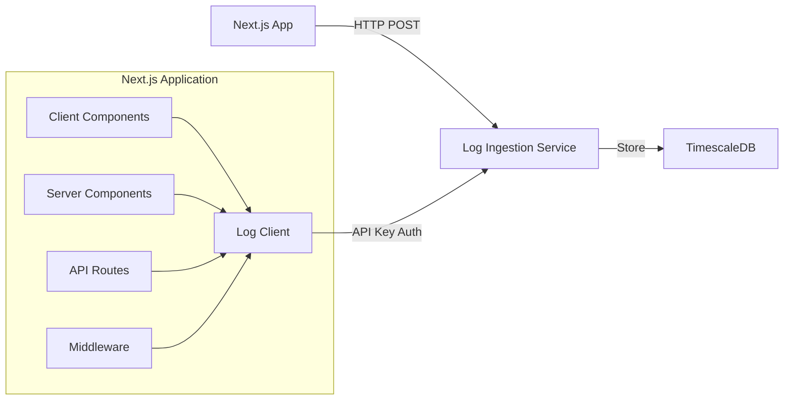

# React/Next.js Integration Guide

This guide provides comprehensive instructions for integrating the Log Ingestion Service into a React/Next.js 13+ application using the App Router.

## Table of Contents

- [Overview](#overview)
- [Prerequisites](#prerequisites)
- [Localhost Setup](#localhost-setup)
- [Production Setup](#production-setup)
- [Integration Implementation](#integration-implementation)
- [Code Examples](#code-examples)
- [Best Practices](#best-practices)
- [Troubleshooting](#troubleshooting)
- [Advanced Topics](#advanced-topics)

## Overview

The Log Ingestion Service is a high-performance HTTP service that collects, validates, and stores logs in TimescaleDB. This integration enables your Next.js application to send structured logs for centralized monitoring and analysis.

### Architecture



### What This Integration Provides

- **Structured Logging**: Send logs with consistent format (timestamp, level, service, message, metadata)
- **Client-Side Logging**: Log user interactions, errors, and events from the browser
- **Server-Side Logging**: Log server actions, API routes, and backend operations
- **Batch Processing**: Efficiently send multiple logs in a single request
- **Error Handling**: Automatic retry logic with exponential backoff
- **Type Safety**: Full TypeScript support with type definitions
- **Rate Limiting**: Built-in handling for rate limit responses

## Prerequisites

Before you begin, ensure you have:

- **Node.js** 18.0 or later
- **Next.js** 13.0 or later with App Router
- **TypeScript** 5.0 or later (recommended)
- An **API key** from the log ingestion service
- The **service URL** for your environment:
  - Localhost: `http://localhost:8080`
  - Production: Your production service URL (e.g., `https://cmdlog.tech`)

## Localhost Setup

### Step 1: Start the Log Ingestion Service

If you haven't already, start the log ingestion service locally:

```bash
# Navigate to the log ingestion service directory
cd /path/to/cmd-log

# Start TimescaleDB
make docker-up

# Run database migrations
make migrate

# Start the service
make run
```

The service will be available at `http://localhost:8080`.

### Step 2: Configure API Key

Set up an API key for local development. You can configure this via environment variables:

```bash
# In the log ingestion service directory
export LOG_INGESTION_API_KEYS="dev-api-key-12345"
```

Or add it to a `.env` file in the service directory.

### Step 3: Verify Service Health

Test that the service is running:

```bash
curl http://localhost:8080/health
```

You should receive: `{"status":"healthy"}`

### Step 4: Configure Next.js Environment Variables

Create a `.env.local` file in your Next.js project root:

```bash
# .env.local
NEXT_PUBLIC_LOG_INGESTION_URL=http://localhost:8080
LOG_INGESTION_API_KEY=dev-api-key-12345
```

**Important Notes:**
- `NEXT_PUBLIC_*` variables are exposed to the browser (use for client-side logging)
- Variables without `NEXT_PUBLIC_` prefix are server-only (use for server-side logging)
- Never commit `.env.local` to version control

### Step 5: Test the Connection

Create a test file to verify the integration:

```typescript
// app/test-logging/page.tsx
'use client';

import { useEffect } from 'react';
import { logClient } from '@/lib/logging/client';

export default function TestLogging() {
  useEffect(() => {
    logClient.log({
      service: 'nextjs-app',
      level: 'INFO',
      message: 'Test log from Next.js',
      metadata: {
        test: true,
        timestamp: new Date().toISOString(),
      },
    });
  }, []);

  return <div>Check your logs!</div>;
}
```

## Production Setup

### Step 1: Configure Environment Variables

Set environment variables in your production environment (Vercel, AWS, etc.):

**For Vercel:**
1. Go to your project settings
2. Navigate to "Environment Variables"
3. Add the following:

```
NEXT_PUBLIC_LOG_INGESTION_URL=https://cmdlog.tech
LOG_INGESTION_API_KEY=your-production-api-key
```

**For Other Platforms:**
Set the same environment variables through your platform's configuration interface.

### Step 2: Secure API Key Management

**Best Practices:**
- Use different API keys for different environments (dev, staging, production)
- Rotate API keys regularly
- Never expose API keys in client-side code (use server-side logging for sensitive operations)
- Store API keys in secure environment variable management systems
- Use separate API keys for client-side vs server-side logging if your service supports it

### Step 3: Verify Production Endpoint

Test your production endpoint:

```bash
curl https://cmdlog.tech/health
```

### Step 4: Configure CORS (if needed)

If your log ingestion service requires CORS configuration, ensure your production service allows requests from your Next.js application domain.

## Integration Implementation

### TypeScript Type Definitions

First, create TypeScript types that match the log ingestion service API:

```typescript
// lib/logging/types.ts

export type LogLevel = 'DEBUG' | 'INFO' | 'WARN' | 'WARNING' | 'ERROR' | 'FATAL' | 'CRITICAL';

export interface LogEntry {
  timestamp: string; // ISO 8601 format
  service: string;
  level: LogLevel;
  message: string;
  metadata?: Record<string, unknown>;
}

export interface LogRequest {
  log: LogEntry;
}

export interface BatchLogRequest {
  logs: LogEntry[];
}

export interface LogResponse {
  message: string;
}

export interface BatchLogResponse {
  message: string;
  accepted: number;
  total: number;
  errors?: string[];
  rejected?: number;
}

export interface LogClientConfig {
  apiUrl: string;
  apiKey: string;
  service: string;
  enableBatching?: boolean;
  batchSize?: number;
  batchInterval?: number; // milliseconds
  maxRetries?: number;
  retryDelay?: number; // milliseconds
  onError?: (error: Error) => void;
}

export interface QueuedLog {
  entry: LogEntry;
  retries: number;
  timestamp: number;
}
```

### Log Client Library

Create a comprehensive log client with retry logic, batching, and error handling:

```typescript
// lib/logging/client.ts

import type {
  LogEntry,
  LogClientConfig,
  LogLevel,
  QueuedLog,
  BatchLogResponse,
  LogResponse,
} from './types';

class LogClient {
  private config: Required<LogClientConfig>;
  private queue: QueuedLog[] = [];
  private batchTimer: NodeJS.Timeout | null = null;
  private isProcessing = false;
  private failedLogs: QueuedLog[] = [];

  constructor(config: LogClientConfig) {
    this.config = {
      enableBatching: true,
      batchSize: 10,
      batchInterval: 5000, // 5 seconds
      maxRetries: 3,
      retryDelay: 1000, // 1 second
      onError: (error) => console.error('Log client error:', error),
      ...config,
    };

    // Start batch processing if enabled
    if (this.config.enableBatching) {
      this.startBatchProcessor();
    }

    // Handle page unload to flush remaining logs
    if (typeof window !== 'undefined') {
      window.addEventListener('beforeunload', () => {
        this.flush();
      });
    }
  }

  /**
   * Create a log entry with automatic timestamp
   */
  private createLogEntry(
    level: LogLevel,
    message: string,
    metadata?: Record<string, unknown>
  ): LogEntry {
    return {
      timestamp: new Date().toISOString(),
      service: this.config.service,
      level,
      message,
      metadata: {
        ...metadata,
        // Add client-side metadata
        ...(typeof window !== 'undefined' && {
          userAgent: navigator.userAgent,
          url: window.location.href,
          referrer: document.referrer,
        }),
      },
    };
  }

  /**
   * Send a single log entry
   */
  async log(
    level: LogLevel,
    message: string,
    metadata?: Record<string, unknown>
  ): Promise<void> {
    const entry = this.createLogEntry(level, message, metadata);

    if (this.config.enableBatching) {
      this.queueLog(entry);
    } else {
      await this.sendLog(entry);
    }
  }

  /**
   * Convenience methods for different log levels
   */
  debug(message: string, metadata?: Record<string, unknown>): Promise<void> {
    return this.log('DEBUG', message, metadata);
  }

  info(message: string, metadata?: Record<string, unknown>): Promise<void> {
    return this.log('INFO', message, metadata);
  }

  warn(message: string, metadata?: Record<string, unknown>): Promise<void> {
    return this.log('WARN', message, metadata);
  }

  error(message: string, metadata?: Record<string, unknown>): Promise<void> {
    return this.log('ERROR', message, metadata);
  }

  fatal(message: string, metadata?: Record<string, unknown>): Promise<void> {
    return this.log('FATAL', message, metadata);
  }

  /**
   * Send a log entry directly (no batching)
   */
  async sendLog(entry: LogEntry, retries = 0): Promise<void> {
    try {
      const response = await fetch(`${this.config.apiUrl}/api/v1/logs`, {
        method: 'POST',
        headers: {
          'Content-Type': 'application/json',
          'X-API-Key': this.config.apiKey,
        },
        body: JSON.stringify({ log: entry }),
      });

      if (!response.ok) {
        if (response.status === 429) {
          // Rate limited - add to queue for retry
          this.queueLog(entry, retries);
          return;
        }

        const errorData = await response.json().catch(() => ({}));
        throw new Error(
          `Log ingestion failed: ${response.status} ${response.statusText} - ${errorData.error || 'Unknown error'}`
        );
      }

      const data: LogResponse = await response.json();
      return;
    } catch (error) {
      const err = error instanceof Error ? error : new Error(String(error));

      if (retries < this.config.maxRetries) {
        // Exponential backoff
        const delay = this.config.retryDelay * Math.pow(2, retries);
        await new Promise((resolve) => setTimeout(resolve, delay));
        return this.sendLog(entry, retries + 1);
      }

      // Max retries reached
      this.config.onError(err);
      this.failedLogs.push({
        entry,
        retries: retries + 1,
        timestamp: Date.now(),
      });
      throw err;
    }
  }

  /**
   * Queue a log entry for batch processing
   */
  private queueLog(entry: LogEntry, retries = 0): void {
    this.queue.push({
      entry,
      retries,
      timestamp: Date.now(),
    });

    // Flush immediately if batch size is reached
    if (this.queue.length >= this.config.batchSize) {
      this.flush();
    }
  }

  /**
   * Send batched logs
   */
  async sendBatch(logs: LogEntry[]): Promise<void> {
    if (logs.length === 0) return;

    try {
      const response = await fetch(`${this.config.apiUrl}/api/v1/logs/batch`, {
        method: 'POST',
        headers: {
          'Content-Type': 'application/json',
          'X-API-Key': this.config.apiKey,
        },
        body: JSON.stringify({ logs }),
      });

      if (!response.ok) {
        if (response.status === 429) {
          // Rate limited - requeue logs
          logs.forEach((log) => this.queueLog(log));
          return;
        }

        const errorData = await response.json().catch(() => ({}));
        throw new Error(
          `Batch log ingestion failed: ${response.status} ${response.statusText} - ${errorData.error || 'Unknown error'}`
        );
      }

      const data: BatchLogResponse = await response.json();

      // Handle partial failures
      if (data.errors && data.errors.length > 0) {
        console.warn('Some logs were rejected:', data.errors);
      }
    } catch (error) {
      const err = error instanceof Error ? error : new Error(String(error));

      // Retry individual logs
      logs.forEach((log) => {
        const queuedLog = this.queue.find((q) => q.entry === log);
        if (queuedLog && queuedLog.retries < this.config.maxRetries) {
          queuedLog.retries++;
          this.queueLog(log, queuedLog.retries);
        } else {
          this.config.onError(err);
        }
      });
    }
  }

  /**
   * Start the batch processor
   */
  private startBatchProcessor(): void {
    this.batchTimer = setInterval(() => {
      if (this.queue.length > 0 && !this.isProcessing) {
        this.flush();
      }
    }, this.config.batchInterval);
  }

  /**
   * Flush all queued logs
   */
  async flush(): Promise<void> {
    if (this.isProcessing || this.queue.length === 0) return;

    this.isProcessing = true;
    const logsToSend = this.queue.splice(0, this.config.batchSize);
    const entries = logsToSend.map((q) => q.entry);

    try {
      await this.sendBatch(entries);
    } finally {
      this.isProcessing = false;
    }
  }

  /**
   * Get failed logs for manual retry
   */
  getFailedLogs(): QueuedLog[] {
    return [...this.failedLogs];
  }

  /**
   * Retry failed logs
   */
  async retryFailedLogs(): Promise<void> {
    const failed = this.failedLogs.splice(0);
    for (const queuedLog of failed) {
      await this.sendLog(queuedLog.entry, queuedLog.retries);
    }
  }

  /**
   * Destroy the client and flush remaining logs
   */
  async destroy(): Promise<void> {
    if (this.batchTimer) {
      clearInterval(this.batchTimer);
      this.batchTimer = null;
    }
    await this.flush();
  }
}

// Create singleton instance
let clientInstance: LogClient | null = null;

/**
 * Initialize the log client
 */
export function initLogClient(config: LogClientConfig): LogClient {
  if (clientInstance) {
    clientInstance.destroy();
  }
  clientInstance = new LogClient(config);
  return clientInstance;
}

/**
 * Get the log client instance
 */
export function getLogClient(): LogClient {
  if (!clientInstance) {
    throw new Error(
      'Log client not initialized. Call initLogClient() first.'
    );
  }
  return clientInstance;
}

/**
 * Create and export a configured log client
 */
export const logClient = (() => {
  if (typeof window === 'undefined') {
    // Server-side: return a no-op client or throw
    return {
      log: async () => {},
      debug: async () => {},
      info: async () => {},
      warn: async () => {},
      error: async () => {},
      fatal: async () => {},
      sendLog: async () => {},
      flush: async () => {},
      destroy: async () => {},
    } as unknown as LogClient;
  }

  const apiUrl = process.env.NEXT_PUBLIC_LOG_INGESTION_URL;
  const apiKey = process.env.NEXT_PUBLIC_LOG_INGESTION_API_KEY;

  if (!apiUrl || !apiKey) {
    console.warn(
      'Log ingestion not configured. Set NEXT_PUBLIC_LOG_INGESTION_URL and NEXT_PUBLIC_LOG_INGESTION_API_KEY'
    );
    return {
      log: async () => {},
      debug: async () => {},
      info: async () => {},
      warn: async () => {},
      error: async () => {},
      fatal: async () => {},
      sendLog: async () => {},
      flush: async () => {},
      destroy: async () => {},
    } as unknown as LogClient;
  }

  return initLogClient({
    apiUrl,
    apiKey,
    service: 'nextjs-app',
    enableBatching: true,
    batchSize: 10,
    batchInterval: 5000,
    maxRetries: 3,
    retryDelay: 1000,
  });
})();
```

### Server-Side Log Client

For server-side logging (API routes, server components, server actions), create a separate client that uses server-only environment variables:

```typescript
// lib/logging/server-client.ts

import type { LogEntry, LogLevel, LogResponse, BatchLogResponse } from './types';

class ServerLogClient {
  private apiUrl: string;
  private apiKey: string;
  private service: string;

  constructor() {
    this.apiUrl = process.env.LOG_INGESTION_URL || process.env.NEXT_PUBLIC_LOG_INGESTION_URL || '';
    this.apiKey = process.env.LOG_INGESTION_API_KEY || '';
    this.service = process.env.LOG_INGESTION_SERVICE || 'nextjs-app';

    if (!this.apiUrl || !this.apiKey) {
      console.warn(
        'Server log ingestion not configured. Set LOG_INGESTION_URL and LOG_INGESTION_API_KEY'
      );
    }
  }

  private createLogEntry(
    level: LogLevel,
    message: string,
    metadata?: Record<string, unknown>
  ): LogEntry {
    return {
      timestamp: new Date().toISOString(),
      service: this.service,
      level,
      message,
      metadata,
    };
  }

  async log(
    level: LogLevel,
    message: string,
    metadata?: Record<string, unknown>
  ): Promise<void> {
    if (!this.apiUrl || !this.apiKey) {
      return; // Silently fail if not configured
    }

    const entry = this.createLogEntry(level, message, metadata);

    try {
      const response = await fetch(`${this.apiUrl}/api/v1/logs`, {
        method: 'POST',
        headers: {
          'Content-Type': 'application/json',
          'X-API-Key': this.apiKey,
        },
        body: JSON.stringify({ log: entry }),
      });

      if (!response.ok) {
        const errorData = await response.json().catch(() => ({}));
        console.error('Server log ingestion failed:', {
          status: response.status,
          error: errorData.error || 'Unknown error',
        });
      }
    } catch (error) {
      // Don't throw - logging failures shouldn't break the app
      console.error('Server log ingestion error:', error);
    }
  }

  async debug(message: string, metadata?: Record<string, unknown>): Promise<void> {
    return this.log('DEBUG', message, metadata);
  }

  async info(message: string, metadata?: Record<string, unknown>): Promise<void> {
    return this.log('INFO', message, metadata);
  }

  async warn(message: string, metadata?: Record<string, unknown>): Promise<void> {
    return this.log('WARN', message, metadata);
  }

  async error(message: string, metadata?: Record<string, unknown>): Promise<void> {
    return this.log('ERROR', message, metadata);
  }

  async fatal(message: string, metadata?: Record<string, unknown>): Promise<void> {
    return this.log('FATAL', message, metadata);
  }

  async sendBatch(logs: LogEntry[]): Promise<void> {
    if (!this.apiUrl || !this.apiKey || logs.length === 0) {
      return;
    }

    try {
      const response = await fetch(`${this.apiUrl}/api/v1/logs/batch`, {
        method: 'POST',
        headers: {
          'Content-Type': 'application/json',
          'X-API-Key': this.apiKey,
        },
        body: JSON.stringify({ logs }),
      });

      if (!response.ok) {
        const errorData = await response.json().catch(() => ({}));
        console.error('Server batch log ingestion failed:', {
          status: response.status,
          error: errorData.error || 'Unknown error',
        });
      } else {
        const data: BatchLogResponse = await response.json();
        if (data.errors && data.errors.length > 0) {
          console.warn('Some server logs were rejected:', data.errors);
        }
      }
    } catch (error) {
      console.error('Server batch log ingestion error:', error);
    }
  }
}

export const serverLogClient = new ServerLogClient();
```

### React Hooks

Create custom React hooks for easy logging in components:

```typescript
// lib/logging/hooks.ts

'use client';

import { useCallback, useEffect, useRef } from 'react';
import { logClient } from './client';
import type { LogLevel } from './types';

/**
 * Hook for logging in React components
 */
export function useLogIngestion() {
  const log = useCallback(
    (level: LogLevel, message: string, metadata?: Record<string, unknown>) => {
      logClient.log(level, message, metadata);
    },
    []
  );

  const debug = useCallback(
    (message: string, metadata?: Record<string, unknown>) => {
      logClient.debug(message, metadata);
    },
    []
  );

  const info = useCallback(
    (message: string, metadata?: Record<string, unknown>) => {
      logClient.info(message, metadata);
    },
    []
  );

  const warn = useCallback(
    (message: string, metadata?: Record<string, unknown>) => {
      logClient.warn(message, metadata);
    },
    []
  );

  const error = useCallback(
    (message: string, metadata?: Record<string, unknown>) => {
      logClient.error(message, metadata);
    },
    []
  );

  const fatal = useCallback(
    (message: string, metadata?: Record<string, unknown>) => {
      logClient.fatal(message, metadata);
    },
    []
  );

  return {
    log,
    debug,
    info,
    warn,
    error,
    fatal,
  };
}

/**
 * Hook for logging errors in error boundaries
 */
export function useLogError() {
  const logError = useCallback(
    (error: Error, errorInfo?: React.ErrorInfo) => {
      logClient.error('React Error Boundary caught an error', {
        error: {
          name: error.name,
          message: error.message,
          stack: error.stack,
        },
        errorInfo: errorInfo
          ? {
              componentStack: errorInfo.componentStack,
            }
          : undefined,
      });
    },
    []
  );

  return { logError };
}

/**
 * Hook for automatic page view logging
 */
export function usePageView(pageName?: string) {
  const hasLogged = useRef(false);

  useEffect(() => {
    if (hasLogged.current) return;

    const name = pageName || window.location.pathname;
    logClient.info('Page view', {
      page: name,
      timestamp: new Date().toISOString(),
    });

    hasLogged.current = true;
  }, [pageName]);
}

/**
 * Hook for logging user interactions
 */
export function useInteractionLogging() {
  const logInteraction = useCallback(
    (
      action: string,
      element?: string,
      metadata?: Record<string, unknown>
    ) => {
      logClient.info('User interaction', {
        action,
        element,
        ...metadata,
      });
    },
    []
  );

  return { logInteraction };
}
```

### Error Boundary Integration

Create an error boundary that automatically logs errors:

```typescript
// components/ErrorBoundary.tsx

'use client';

import React from 'react';
import { useLogError } from '@/lib/logging/hooks';

interface ErrorBoundaryProps {
  children: React.ReactNode;
  fallback?: React.ComponentType<{ error: Error; resetError: () => void }>;
}

interface ErrorBoundaryState {
  hasError: boolean;
  error: Error | null;
}

export class ErrorBoundary extends React.Component<
  ErrorBoundaryProps,
  ErrorBoundaryState
> {
  constructor(props: ErrorBoundaryProps) {
    super(props);
    this.state = { hasError: false, error: null };
  }

  static getDerivedStateFromError(error: Error): ErrorBoundaryState {
    return { hasError: true, error };
  }

  componentDidCatch(error: Error, errorInfo: React.ErrorInfo) {
    // Log the error using the hook (via a wrapper component)
    console.error('ErrorBoundary caught an error:', error, errorInfo);
  }

  resetError = () => {
    this.setState({ hasError: false, error: null });
  };

  render() {
    if (this.state.hasError && this.state.error) {
      if (this.props.fallback) {
        const Fallback = this.props.fallback;
        return <Fallback error={this.state.error} resetError={this.resetError} />;
      }

      return (
        <ErrorFallback error={this.state.error} resetError={this.resetError} />
      );
    }

    return this.props.children;
  }
}

// Wrapper component to use the hook
function ErrorBoundaryWithLogging({
  children,
  fallback,
}: ErrorBoundaryProps) {
  const { logError } = useLogError();

  return (
    <ErrorBoundary
      fallback={({ error, resetError }) => {
        // Log error when fallback is rendered
        React.useEffect(() => {
          logError(error);
        }, [error]);

        if (fallback) {
          const Fallback = fallback;
          return <Fallback error={error} resetError={resetError} />;
        }
        return <ErrorFallback error={error} resetError={resetError} />;
      }}
    >
      {children}
    </ErrorBoundary>
  );
}

function ErrorFallback({
  error,
  resetError,
}: {
  error: Error;
  resetError: () => void;
}) {
  return (
    <div className="error-boundary">
      <h2>Something went wrong</h2>
      <p>{error.message}</p>
      <button onClick={resetError}>Try again</button>
    </div>
  );
}

export default ErrorBoundaryWithLogging;
```

### Next.js Middleware

Create middleware to automatically log requests:

```typescript
// middleware.ts

import { NextResponse } from 'next/server';
import type { NextRequest } from 'next/server';
import { serverLogClient } from '@/lib/logging/server-client';

export function middleware(request: NextRequest) {
  const startTime = Date.now();

  // Log request
  serverLogClient.info('HTTP Request', {
    method: request.method,
    path: request.nextUrl.pathname,
    query: Object.fromEntries(request.nextUrl.searchParams),
    headers: {
      'user-agent': request.headers.get('user-agent'),
      referer: request.headers.get('referer'),
    },
    ip: request.ip || request.headers.get('x-forwarded-for'),
  });

  const response = NextResponse.next();

  // Log response after processing
  response.headers.set('X-Process-Time', String(Date.now() - startTime));

  return response;
}

export const config = {
  matcher: [
    /*
     * Match all request paths except for the ones starting with:
     * - api (API routes)
     * - _next/static (static files)
     * - _next/image (image optimization files)
     * - favicon.ico (favicon file)
     */
    '/((?!api|_next/static|_next/image|favicon.ico).*)',
  ],
};
```

### API Route Example

Example of logging in API routes:

```typescript
// app/api/users/route.ts

import { NextRequest, NextResponse } from 'next/server';
import { serverLogClient } from '@/lib/logging/server-client';

export async function GET(request: NextRequest) {
  try {
    serverLogClient.info('Fetching users', {
      method: 'GET',
      path: '/api/users',
    });

    // Your logic here
    const users = await fetchUsers();

    serverLogClient.info('Users fetched successfully', {
      count: users.length,
    });

    return NextResponse.json({ users });
  } catch (error) {
    const err = error instanceof Error ? error : new Error(String(error));

    serverLogClient.error('Failed to fetch users', {
      error: {
        name: err.name,
        message: err.message,
        stack: err.stack,
      },
    });

    return NextResponse.json(
      { error: 'Failed to fetch users' },
      { status: 500 }
    );
  }
}
```

### Server Action Example

Example of logging in server actions:

```typescript
// app/actions/user-actions.ts

'use server';

import { serverLogClient } from '@/lib/logging/server-client';
import { revalidatePath } from 'next/cache';

export async function createUser(formData: FormData) {
  try {
    const name = formData.get('name') as string;
    const email = formData.get('email') as string;

    serverLogClient.info('Creating user', {
      name,
      email: email.replace(/@.*/, '@***'), // Partially mask email
    });

    // Your logic here
    const user = await db.users.create({ name, email });

    serverLogClient.info('User created successfully', {
      userId: user.id,
    });

    revalidatePath('/users');
    return { success: true, user };
  } catch (error) {
    const err = error instanceof Error ? error : new Error(String(error));

    serverLogClient.error('Failed to create user', {
      error: {
        name: err.name,
        message: err.message,
      },
    });

    return { success: false, error: err.message };
  }
}
```

## Code Examples

### Client-Side Component Example

```typescript
// app/dashboard/page.tsx

'use client';

import { useLogIngestion, usePageView } from '@/lib/logging/hooks';
import { useEffect, useState } from 'react';

export default function Dashboard() {
  const { info, error } = useLogIngestion();
  usePageView('dashboard');

  const [data, setData] = useState(null);

  useEffect(() => {
    async function fetchData() {
      try {
        info('Fetching dashboard data');
        const response = await fetch('/api/dashboard');
        if (!response.ok) throw new Error('Failed to fetch');
        const data = await response.json();
        setData(data);
        info('Dashboard data loaded successfully', { itemCount: data.length });
      } catch (err) {
        error('Failed to load dashboard data', {
          error: err instanceof Error ? err.message : 'Unknown error',
        });
      }
    }

    fetchData();
  }, [info, error]);

  return <div>Dashboard content...</div>;
}
```

### Form Submission Logging

```typescript
// app/contact/page.tsx

'use client';

import { useLogIngestion } from '@/lib/logging/hooks';
import { useState } from 'react';

export default function ContactPage() {
  const { info, error } = useLogIngestion();
  const [submitting, setSubmitting] = useState(false);

  async function handleSubmit(e: React.FormEvent<HTMLFormElement>) {
    e.preventDefault();
    setSubmitting(true);

    try {
      info('Contact form submitted', {
        formType: 'contact',
      });

      const formData = new FormData(e.currentTarget);
      const response = await fetch('/api/contact', {
        method: 'POST',
        body: formData,
      });

      if (!response.ok) throw new Error('Submission failed');

      info('Contact form submitted successfully');
      // Reset form, show success message, etc.
    } catch (err) {
      error('Contact form submission failed', {
        error: err instanceof Error ? err.message : 'Unknown error',
      });
    } finally {
      setSubmitting(false);
    }
  }

  return (
    <form onSubmit={handleSubmit}>
      {/* Form fields */}
      <button type="submit" disabled={submitting}>
        Submit
      </button>
    </form>
  );
}
```

### Batch Logging Example

```typescript
// lib/logging/batch-example.ts

import { logClient } from './client';

// Log multiple events at once
export async function logUserSession(events: Array<{ action: string; metadata?: Record<string, unknown> }>) {
  // The client will automatically batch these if batching is enabled
  for (const event of events) {
    await logClient.info(`User action: ${event.action}`, event.metadata);
  }

  // Or manually flush to send immediately
  await logClient.flush();
}
```

## Best Practices

### When to Log (Client vs Server)

**Client-Side Logging:**
- User interactions (clicks, form submissions)
- Client-side errors and exceptions
- Performance metrics (page load times, render times)
- User journey tracking
- Client-side validation failures

**Server-Side Logging:**
- API request/response logging
- Database operations
- Authentication/authorization events
- Server errors and exceptions
- Business logic events
- Sensitive operations (never log from client)

### Log Levels

- **DEBUG**: Detailed information for debugging (development only)
- **INFO**: General informational messages (user actions, successful operations)
- **WARN**: Warning messages (deprecated features, recoverable errors)
- **ERROR**: Error events that don't stop the application
- **FATAL/CRITICAL**: Critical errors that may cause the application to abort

### Metadata Best Practices

**Do:**
- Include relevant context (user ID, request ID, session ID)
- Add timestamps for time-sensitive operations
- Include error details (name, message, stack trace)
- Add performance metrics when relevant
- Include feature flags or A/B test variants

**Don't:**
- Include sensitive data (passwords, tokens, API keys, credit cards)
- Log PII (personally identifiable information) unless necessary and compliant
- Include excessive data that bloats logs
- Log the same information multiple times

### Rate Limiting Considerations

- The service has rate limiting enabled by default (100 RPS, 200 burst)
- Use batching to reduce request count
- Implement client-side queuing for high-volume scenarios
- Monitor rate limit responses (429 status) and adjust accordingly
- Consider using separate API keys for different services/components

### Performance Optimization

- **Enable Batching**: Reduces network requests and improves performance
- **Async Logging**: Don't block the main thread waiting for log requests
- **Queue Management**: Limit queue size to prevent memory issues
- **Debounce High-Frequency Events**: Don't log every keystroke or mouse move
- **Conditional Logging**: Use feature flags to disable logging in development if needed

### Security Considerations

- **Never expose API keys in client-side code**: Use `NEXT_PUBLIC_*` variables only for non-sensitive client-side logging
- **Use separate API keys**: Different keys for client vs server, dev vs production
- **Sanitize metadata**: The service automatically removes sensitive fields, but be cautious
- **HTTPS only**: Always use HTTPS in production
- **Validate input**: Don't trust client-side data in server logs

## Troubleshooting

### Common Errors

#### "Log client not initialized"

**Problem:** The log client is being used before initialization.

**Solution:**
```typescript
// Make sure to initialize before use
import { initLogClient } from '@/lib/logging/client';

initLogClient({
  apiUrl: process.env.NEXT_PUBLIC_LOG_INGESTION_URL!,
  apiKey: process.env.NEXT_PUBLIC_LOG_INGESTION_API_KEY!,
  service: 'my-app',
});
```

#### "API key is required" (401 Unauthorized)

**Problem:** API key is missing or incorrect.

**Solutions:**
1. Check environment variables are set correctly
2. Verify the API key in your log ingestion service configuration
3. Ensure `NEXT_PUBLIC_*` prefix is used for client-side variables
4. Check that the API key is not expired or revoked

#### "Rate limit exceeded" (429 Too Many Requests)

**Problem:** Too many requests sent in a short time.

**Solutions:**
1. Enable batching in the log client configuration
2. Increase batch size and interval
3. Reduce logging frequency
4. Contact service administrator to increase rate limits

#### Network Errors (CORS, Connection Refused)

**Problem:** Cannot connect to the log ingestion service.

**Solutions:**
1. Verify the service URL is correct
2. Check if the service is running (localhost) or accessible (production)
3. Verify CORS configuration on the service
4. Check firewall/network settings
5. Test with curl: `curl http://localhost:8080/health`

#### Logs Not Appearing

**Problem:** Logs are sent but not visible in the database.

**Solutions:**
1. Check service logs for errors
2. Verify database connection in the log ingestion service
3. Check if logs are being batched (may take a few seconds to flush)
4. Manually flush: `await logClient.flush()`
5. Check service health: `curl http://localhost:8080/health`

### Debugging Tips

1. **Enable Console Logging**: Temporarily add console.log to see what's being sent
2. **Check Network Tab**: Inspect requests in browser DevTools
3. **Verify Environment Variables**: Log them (safely, without exposing keys) to confirm they're set
4. **Test with curl**: Verify the service works independently
5. **Check Service Logs**: Look at the log ingestion service logs for errors

### Network Issues

If you're experiencing network issues:

1. **Check Service Health**: `curl http://localhost:8080/health`
2. **Test Authentication**: 
   ```bash
   curl -X POST http://localhost:8080/api/v1/logs \
     -H "Content-Type: application/json" \
     -H "X-API-Key: your-api-key" \
     -d '{"log":{"timestamp":"2024-01-01T12:00:00Z","service":"test","level":"INFO","message":"test"}}'
   ```
3. **Verify CORS**: Check browser console for CORS errors
4. **Check Firewall**: Ensure ports are open (8080 for localhost)

### Authentication Problems

If authentication is failing:

1. **Verify API Key Format**: No extra spaces or newlines
2. **Check Header Name**: Must be `X-API-Key` or `Authorization: Bearer <key>`
3. **Test with curl**: Use the same headers to isolate the issue
4. **Check Service Configuration**: Verify API keys are configured in the service

## Advanced Topics

### Custom Batching Strategies

Implement custom batching based on your needs:

```typescript
// lib/logging/custom-batcher.ts

import { logClient } from './client';
import type { LogEntry } from './types';

class CustomBatcher {
  private logs: LogEntry[] = [];
  private maxSize = 50;
  private maxAge = 10000; // 10 seconds
  private timer: NodeJS.Timeout | null = null;

  add(entry: LogEntry) {
    this.logs.push(entry);

    // Flush if size limit reached
    if (this.logs.length >= this.maxSize) {
      this.flush();
      return;
    }

    // Start timer if this is the first log
    if (this.logs.length === 1) {
      this.timer = setTimeout(() => this.flush(), this.maxAge);
    }
  }

  async flush() {
    if (this.timer) {
      clearTimeout(this.timer);
      this.timer = null;
    }

    if (this.logs.length === 0) return;

    const logsToSend = [...this.logs];
    this.logs = [];

    // Send via log client
    for (const log of logsToSend) {
      await logClient.sendLog(log);
    }
  }
}
```

### Offline Queue Management

Handle offline scenarios by queuing logs locally:

```typescript
// lib/logging/offline-queue.ts

class OfflineQueue {
  private queue: LogEntry[] = [];
  private storageKey = 'log-queue';

  constructor() {
    this.loadQueue();
    this.setupOnlineListener();
  }

  private loadQueue() {
    if (typeof window === 'undefined') return;

    try {
      const stored = localStorage.getItem(this.storageKey);
      if (stored) {
        this.queue = JSON.parse(stored);
      }
    } catch (error) {
      console.error('Failed to load log queue:', error);
    }
  }

  private saveQueue() {
    if (typeof window === 'undefined') return;

    try {
      localStorage.setItem(this.storageKey, JSON.stringify(this.queue));
    } catch (error) {
      console.error('Failed to save log queue:', error);
    }
  }

  add(entry: LogEntry) {
    this.queue.push(entry);
    this.saveQueue();
  }

  async flush() {
    if (this.queue.length === 0) return;

    const logsToSend = [...this.queue];
    this.queue = [];
    this.saveQueue();

    try {
      // Try to send logs
      await logClient.sendBatch(logsToSend);
    } catch (error) {
      // Re-queue if failed
      this.queue.unshift(...logsToSend);
      this.saveQueue();
      throw error;
    }
  }

  private setupOnlineListener() {
    if (typeof window === 'undefined') return;

    window.addEventListener('online', () => {
      this.flush().catch(console.error);
    });
  }
}
```

### Performance Monitoring

Add performance logging:

```typescript
// lib/logging/performance.ts

import { logClient } from './client';

export function logPerformance(
  name: string,
  startTime: number,
  metadata?: Record<string, unknown>
) {
  const duration = Date.now() - startTime;
  logClient.info(`Performance: ${name}`, {
    duration,
    ...metadata,
  });
}

// Usage with a decorator-like pattern
export function withPerformanceLogging<T extends (...args: any[]) => Promise<any>>(
  fn: T,
  name: string
): T {
  return (async (...args: any[]) => {
    const startTime = Date.now();
    try {
      const result = await fn(...args);
      logPerformance(name, startTime, { success: true });
      return result;
    } catch (error) {
      logPerformance(name, startTime, {
        success: false,
        error: error instanceof Error ? error.message : 'Unknown error',
      });
      throw error;
    }
  }) as T;
}
```

### Integration with Error Tracking Services

Combine with services like Sentry:

```typescript
// lib/logging/sentry-integration.ts

import * as Sentry from '@sentry/nextjs';
import { logClient } from './client';

export function logErrorWithSentry(
  error: Error,
  context?: Record<string, unknown>
) {
  // Send to Sentry
  Sentry.captureException(error, {
    contexts: {
      custom: context,
    },
  });

  // Also send to log ingestion service
  logClient.error('Error captured', {
    error: {
      name: error.name,
      message: error.message,
      stack: error.stack,
    },
    ...context,
  });
}
```

## Summary

This integration guide provides everything you need to integrate the Log Ingestion Service into your Next.js application. The implementation includes:

- ✅ Full TypeScript type definitions
- ✅ Comprehensive client library with retry logic and batching
- ✅ Server-side logging utilities
- ✅ React hooks for easy component integration
- ✅ Error boundary integration
- ✅ Next.js middleware for automatic request logging
- ✅ Production-ready error handling
- ✅ Best practices and troubleshooting guides

For additional support or questions, refer to the main [README.md](../README.md) or [DEPLOYMENT.md](../DEPLOYMENT.md) documentation.

