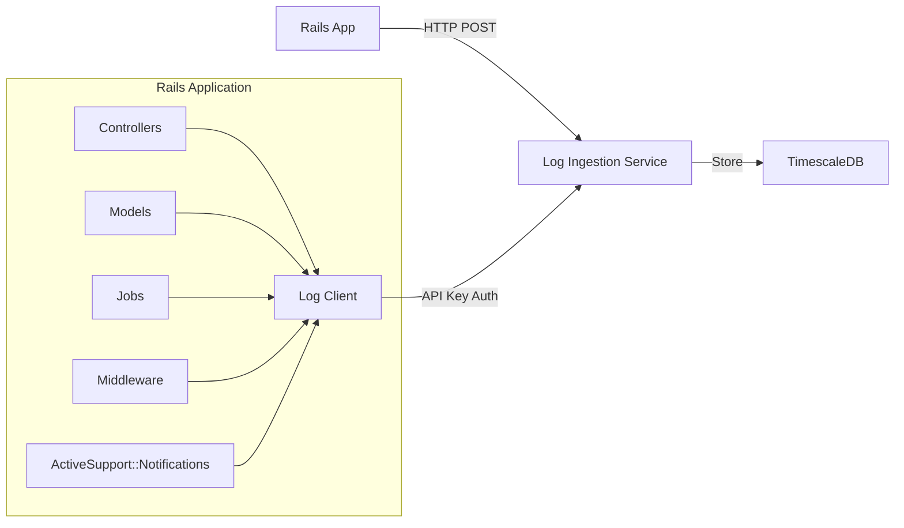

# Ruby on Rails Integration Guide

This guide provides comprehensive instructions for integrating the Log Ingestion Service into a Ruby on Rails application.

## Table of Contents

- [Overview](#overview)
- [Prerequisites](#prerequisites)
- [Localhost Setup](#localhost-setup)
- [Production Setup](#production-setup)
- [Integration Implementation](#integration-implementation)
- [Code Examples](#code-examples)
- [Best Practices](#best-practices)
- [Troubleshooting](#troubleshooting)
- [Advanced Topics](#advanced-topics)

## Overview

The Log Ingestion Service is a high-performance HTTP service that collects, validates, and stores logs in TimescaleDB. This integration enables your Rails application to send structured logs for centralized monitoring and analysis.

### Architecture



### What This Integration Provides

- **Structured Logging**: Send logs with consistent format (timestamp, level, service, message, metadata)
- **Request Logging**: Automatically log HTTP requests and responses via middleware
- **ActiveSupport Integration**: Hook into Rails notifications for automatic event logging
- **Background Job Logging**: Log job execution, failures, and performance
- **Batch Processing**: Efficiently send multiple logs in a single request
- **Error Handling**: Automatic retry logic with exponential backoff
- **Rate Limiting**: Built-in handling for rate limit responses

## Prerequisites

Before you begin, ensure you have:

- **Ruby** 3.0 or later
- **Rails** 7.0 or later
- An **API key** from the log ingestion service
- The **service URL** for your environment:
  - Localhost: `http://localhost:8080`
  - Production: Your production service URL (e.g., `https://cmdlog.tech`)

## Localhost Setup

### Step 1: Start the Log Ingestion Service

If you haven't already, start the log ingestion service locally:

```bash
# Navigate to the log ingestion service directory
cd /path/to/cmd-log

# Start TimescaleDB
make docker-up

# Run database migrations
make migrate

# Start the service
make run
```

The service will be available at `http://localhost:8080`.

### Step 2: Configure API Key

Set up an API key for local development. You can configure this via environment variables:

```bash
# In the log ingestion service directory
export LOG_INGESTION_API_KEYS="dev-api-key-12345"
```

Or add it to a `.env` file in the service directory.

### Step 3: Verify Service Health

Test that the service is running:

```bash
curl http://localhost:8080/health
```

You should receive: `{"status":"healthy"}`

### Step 4: Configure Rails Environment Variables

Add environment variables to your Rails application. You can use several approaches:

**Option 1: Using `config/application.yml` (with `figaro` or `dotenv-rails` gem):**

```yaml
# config/application.yml
development:
  LOG_INGESTION_URL: http://localhost:8080
  LOG_INGESTION_API_KEY: dev-api-key-12345
  LOG_INGESTION_SERVICE: rails-app

production:
  LOG_INGESTION_URL: https://cmdlog.tech
  LOG_INGESTION_API_KEY: <%= ENV['LOG_INGESTION_API_KEY'] %>
  LOG_INGESTION_SERVICE: rails-app
```

**Option 2: Using Rails credentials (Rails 5.2+):**

```bash
# Edit credentials
EDITOR="code --wait" rails credentials:edit

# Add:
log_ingestion:
  url: http://localhost:8080
  api_key: dev-api-key-12345
  service: rails-app
```

**Option 3: Using environment variables directly:**

```bash
# In your shell or .env file
export LOG_INGESTION_URL=http://localhost:8080
export LOG_INGESTION_API_KEY=dev-api-key-12345
export LOG_INGESTION_SERVICE=rails-app
```

### Step 5: Test the Connection

Create a test script to verify the integration:

```ruby
# lib/tasks/test_logging.rake

namespace :logs do
  desc "Test log ingestion service"
  task test: :environment do
    LogIngestionClient.info("Test log from Rails", { test: true })
    puts "Log sent! Check your logs."
  end
end
```

Run it:

```bash
rails logs:test
```

## Production Setup

### Step 1: Configure Environment Variables

Set environment variables in your production environment:

**For Heroku:**
```bash
heroku config:set LOG_INGESTION_URL=https://cmdlog.tech
heroku config:set LOG_INGESTION_API_KEY=your-production-api-key
heroku config:set LOG_INGESTION_SERVICE=rails-app
```

**For AWS/Other Platforms:**
Set the same environment variables through your platform's configuration interface or use Rails encrypted credentials.

### Step 2: Secure API Key Management

**Best Practices:**
- Use different API keys for different environments (dev, staging, production)
- Rotate API keys regularly
- Store API keys in Rails encrypted credentials or secure secret management systems
- Never commit API keys to version control
- Use environment-specific credentials files

### Step 3: Verify Production Endpoint

Test your production endpoint:

```bash
curl https://cmdlog.tech/health
```

### Step 4: Configure CORS (if needed)

If your log ingestion service requires CORS configuration, ensure your production service allows requests from your Rails application domain.

## Integration Implementation

### Service Class

Create a comprehensive log client service with retry logic, batching, and error handling:

```ruby
# app/services/log_ingestion_client.rb

require 'net/http'
require 'json'
require 'uri'

class LogIngestionClient
  LOG_LEVELS = %w[DEBUG INFO WARN WARNING ERROR FATAL CRITICAL].freeze

  class << self
    attr_accessor :api_url, :api_key, :service, :enable_batching, :batch_size,
                  :batch_interval, :max_retries, :retry_delay

    def configure
      self.api_url = ENV['LOG_INGESTION_URL'] || Rails.application.credentials.dig(:log_ingestion, :url)
      self.api_key = ENV['LOG_INGESTION_API_KEY'] || Rails.application.credentials.dig(:log_ingestion, :api_key)
      self.service = ENV['LOG_INGESTION_SERVICE'] || Rails.application.credentials.dig(:log_ingestion, :service) || 'rails-app'
      self.enable_batching = true
      self.batch_size = 10
      self.batch_interval = 5 # seconds
      self.max_retries = 3
      self.retry_delay = 1 # second

      @queue = []
      @mutex = Mutex.new
      @batch_thread = nil

      start_batch_processor if enable_batching
    end

    def log(level, message, metadata = {})
      return unless configured?

      entry = create_log_entry(level, message, metadata)

      if enable_batching
        queue_log(entry)
      else
        send_log(entry)
      end
    end

    # Convenience methods for different log levels
    LOG_LEVELS.each do |level|
      define_method(level.downcase) do |message, metadata = {}|
        log(level, message, metadata)
      end
    end

    def flush
      return if @queue.empty?

      @mutex.synchronize do
        logs_to_send = @queue.shift(batch_size)
        send_batch(logs_to_send) if logs_to_send.any?
      end
    end

    private

    def configured?
      api_url.present? && api_key.present?
    end

    def create_log_entry(level, message, metadata)
      {
        timestamp: Time.current.iso8601,
        service: service,
        level: level,
        message: message,
        metadata: metadata
      }
    end

    def send_log(entry, retries = 0)
      return unless configured?

      uri = URI("#{api_url}/api/v1/logs")
      http = Net::HTTP.new(uri.host, uri.port)
      http.use_ssl = uri.scheme == 'https'
      http.read_timeout = 5
      http.open_timeout = 5

      request = Net::HTTP::Post.new(uri.path)
      request['Content-Type'] = 'application/json'
      request['X-API-Key'] = api_key
      request.body = { log: entry }.to_json

      response = http.request(request)

      case response.code.to_i
      when 200, 201
        JSON.parse(response.body)
      when 429
        # Rate limited - add to queue for retry
        queue_log(entry, retries)
      when 401
        Rails.logger.error "Log ingestion authentication failed. Check API key."
        nil
      else
        error_data = JSON.parse(response.body) rescue {}
        raise "Log ingestion failed: #{response.code} - #{error_data['error'] || 'Unknown error'}"
      end
    rescue => e
      if retries < max_retries
        # Exponential backoff
        delay = retry_delay * (2 ** retries)
        sleep(delay)
        send_log(entry, retries + 1)
      else
        Rails.logger.error "Log ingestion error after #{max_retries} retries: #{e.message}"
        nil
      end
    end

    def queue_log(entry, retries = 0)
      @mutex.synchronize do
        @queue << { entry: entry, retries: retries, timestamp: Time.current.to_i }
      end

      # Flush immediately if batch size is reached
      flush if @queue.size >= batch_size
    end

    def send_batch(logs)
      return unless configured? || logs.empty?

      entries = logs.map { |q| q[:entry] }
      uri = URI("#{api_url}/api/v1/logs/batch")
      http = Net::HTTP.new(uri.host, uri.port)
      http.use_ssl = uri.scheme == 'https'
      http.read_timeout = 10
      http.open_timeout = 5

      request = Net::HTTP::Post.new(uri.path)
      request['Content-Type'] = 'application/json'
      request['X-API-Key'] = api_key
      request.body = { logs: entries }.to_json

      response = http.request(request)

      case response.code.to_i
      when 200, 201
        data = JSON.parse(response.body)
        if data['errors'] && data['errors'].any?
          Rails.logger.warn "Some logs were rejected: #{data['errors']}"
        end
        data
      when 429
        # Rate limited - requeue logs
        logs.each { |q| queue_log(q[:entry], q[:retries]) }
      else
        error_data = JSON.parse(response.body) rescue {}
        Rails.logger.error "Batch log ingestion failed: #{response.code} - #{error_data['error'] || 'Unknown error'}"
        nil
      end
    rescue => e
      Rails.logger.error "Batch log ingestion error: #{e.message}"
      # Retry individual logs
      logs.each do |q|
        if q[:retries] < max_retries
          q[:retries] += 1
          queue_log(q[:entry], q[:retries])
        end
      end
      nil
    end

    def start_batch_processor
      return if @batch_thread&.alive?

      @batch_thread = Thread.new do
        loop do
          sleep batch_interval
          flush
        end
      end
    end
  end

  # Initialize on load
  configure
end
```

### Initializer Configuration

Create an initializer to configure the log client:

```ruby
# config/initializers/log_ingestion.rb

Rails.application.config.after_initialize do
  LogIngestionClient.configure

  # Log Rails startup
  LogIngestionClient.info("Rails application started", {
    environment: Rails.env,
    version: Rails.version,
    ruby_version: RUBY_VERSION
  })
end
```

### Controller Concern

Create a concern for easy logging in controllers:

```ruby
# app/controllers/concerns/loggable.rb

module Loggable
  extend ActiveSupport::Concern

  included do
    around_action :log_request, if: -> { should_log? }
  end

  private

  def log_request
    start_time = Time.current
    request_id = SecureRandom.uuid

    LogIngestionClient.info("HTTP Request", {
      request_id: request_id,
      method: request.method,
      path: request.path,
      params: filtered_params,
      ip: request.remote_ip,
      user_agent: request.user_agent,
      referer: request.referer
    })

    begin
      yield
    rescue => e
      LogIngestionClient.error("Request failed", {
        request_id: request_id,
        error: {
          class: e.class.name,
          message: e.message,
          backtrace: e.backtrace&.first(10)
        }
      })
      raise
    ensure
      duration = ((Time.current - start_time) * 1000).round(2)
      LogIngestionClient.info("HTTP Response", {
        request_id: request_id,
        status: response.status,
        duration_ms: duration
      })
    end
  end

  def should_log?
    !request.path.start_with?('/assets', '/packs', '/rails')
  end

  def filtered_params
    params.except(:controller, :action, :format).to_unsafe_h
  end
end
```

Use it in your controllers:

```ruby
# app/controllers/application_controller.rb

class ApplicationController < ActionController::Base
  include Loggable
  # ...
end
```

### Rails Middleware

Create middleware for automatic request logging:

```ruby
# app/middleware/request_logging_middleware.rb

class RequestLoggingMiddleware
  def initialize(app)
    @app = app
  end

  def call(env)
    request = ActionDispatch::Request.new(env)
    start_time = Time.current

    # Skip logging for assets and health checks
    return @app.call(env) if skip_logging?(request.path)

    request_id = SecureRandom.uuid
    env['request_id'] = request_id

    LogIngestionClient.info("HTTP Request", {
      request_id: request_id,
      method: request.method,
      path: request.path,
      query_string: request.query_string,
      ip: request.ip,
      user_agent: request.user_agent,
      referer: request.referer
    })

    status, headers, response = @app.call(env)

    duration = ((Time.current - start_time) * 1000).round(2)
    LogIngestionClient.info("HTTP Response", {
      request_id: request_id,
      status: status,
      duration_ms: duration,
      content_type: headers['Content-Type']
    })

    [status, headers, response]
  rescue => e
    LogIngestionClient.error("Request error", {
      request_id: request_id,
      error: {
        class: e.class.name,
        message: e.message,
        backtrace: e.backtrace&.first(10)
      }
    })
    raise
  end

  private

  def skip_logging?(path)
    path.start_with?('/assets', '/packs', '/rails', '/favicon.ico')
  end
end
```

Register it in your application:

```ruby
# config/application.rb

module YourApp
  class Application < Rails::Application
    # ... other config ...

    # Add request logging middleware
    config.middleware.insert_before ActionDispatch::ShowExceptions, RequestLoggingMiddleware
  end
end
```

### ActiveSupport::Notifications Integration

Subscribe to Rails notifications for automatic event logging:

```ruby
# config/initializers/active_support_notifications.rb

ActiveSupport::Notifications.subscribe('process_action.action_controller') do |name, start, finish, id, payload|
  duration = ((finish - start) * 1000).round(2)

  LogIngestionClient.info("Action processed", {
    controller: payload[:controller],
    action: payload[:action],
    method: payload[:method],
    path: payload[:path],
    status: payload[:status],
    duration_ms: duration,
    view_runtime: payload[:view_runtime]&.round(2),
    db_runtime: payload[:db_runtime]&.round(2)
  })
end

ActiveSupport::Notifications.subscribe('sql.active_record') do |name, start, finish, id, payload|
  duration = ((finish - start) * 1000).round(2)

  # Only log slow queries
  if duration > 100 # milliseconds
    LogIngestionClient.warn("Slow SQL query", {
      sql: payload[:sql].truncate(500),
      name: payload[:name],
      duration_ms: duration,
      binds: payload[:binds]&.map(&:last)
    })
  end
end

ActiveSupport::Notifications.subscribe('perform.active_job') do |name, start, finish, id, payload|
  duration = ((finish - start) * 1000).round(2)

  LogIngestionClient.info("Job performed", {
    job_class: payload[:job].class.name,
    job_id: payload[:job].job_id,
    queue_name: payload[:job].queue_name,
    duration_ms: duration
  })
end

ActiveSupport::Notifications.subscribe('enqueue.active_job') do |name, start, finish, id, payload|
  LogIngestionClient.info("Job enqueued", {
    job_class: payload[:job].class.name,
    job_id: payload[:job].job_id,
    queue_name: payload[:job].queue_name
  })
end

ActiveSupport::Notifications.subscribe('perform.active_job') do |name, start, finish, id, payload|
  if payload[:exception_object]
    LogIngestionClient.error("Job failed", {
      job_class: payload[:job].class.name,
      job_id: payload[:job].job_id,
      error: {
        class: payload[:exception_object].class.name,
        message: payload[:exception_object].message,
        backtrace: payload[:exception_object].backtrace&.first(10)
      }
    })
  end
end
```

### Background Job Integration

Create a concern for logging in background jobs:

```ruby
# app/jobs/concerns/loggable_job.rb

module LoggableJob
  extend ActiveSupport::Concern

  included do
    around_perform :log_job_execution
  end

  private

  def log_job_execution
    start_time = Time.current
    job_id = job_id || SecureRandom.uuid

    LogIngestionClient.info("Job started", {
      job_class: self.class.name,
      job_id: job_id,
      arguments: job_arguments
    })

    begin
      yield
      duration = ((Time.current - start_time) * 1000).round(2)
      LogIngestionClient.info("Job completed", {
        job_class: self.class.name,
        job_id: job_id,
        duration_ms: duration
      })
    rescue => e
      duration = ((Time.current - start_time) * 1000).round(2)
      LogIngestionClient.error("Job failed", {
        job_class: self.class.name,
        job_id: job_id,
        duration_ms: duration,
        error: {
          class: e.class.name,
          message: e.message,
          backtrace: e.backtrace&.first(10)
        }
      })
      raise
    end
  end

  def job_arguments
    # Override in your job class to customize what gets logged
    arguments
  end
end
```

Use it in your jobs:

```ruby
# app/jobs/example_job.rb

class ExampleJob < ApplicationJob
  include LoggableJob

  def perform(user_id)
    # Your job logic
  end

  private

  def job_arguments
    { user_id: arguments.first }
  end
end
```

### Custom Rails Logger Integration

Create a custom logger that sends logs to the ingestion service:

```ruby
# app/lib/log_ingestion_logger.rb

class LogIngestionLogger < ActiveSupport::Logger
  def initialize(*args)
    super
    @log_ingestion_enabled = Rails.env.production? || ENV['ENABLE_LOG_INGESTION'] == 'true'
  end

  def add(severity, message = nil, progname = nil, &block)
    super

    return unless @log_ingestion_enabled

    message ||= block&.call || progname
    return unless message

    level = severity_to_level(severity)
    LogIngestionClient.log(level, message.to_s, {
      severity: severity,
      progname: progname
    })
  end

  private

  def severity_to_level(severity)
    case severity
    when DEBUG then 'DEBUG'
    when INFO then 'INFO'
    when WARN then 'WARN'
    when ERROR then 'ERROR'
    when FATAL then 'FATAL'
    else 'INFO'
    end
  end
end
```

## Code Examples

### Controller Example

```ruby
# app/controllers/users_controller.rb

class UsersController < ApplicationController
  before_action :set_user, only: [:show, :update, :destroy]

  def index
    LogIngestionClient.info("Fetching users", {
      user_id: current_user&.id,
      filters: params.slice(:status, :role)
    })

    @users = User.all
    LogIngestionClient.info("Users fetched", { count: @users.count })
  end

  def create
    LogIngestionClient.info("Creating user", {
      email: params[:user][:email]&.gsub(/@.*/, '@***') # Mask email
    })

    @user = User.new(user_params)

    if @user.save
      LogIngestionClient.info("User created", { user_id: @user.id })
      render json: @user, status: :created
    else
      LogIngestionClient.warn("User creation failed", {
        errors: @user.errors.full_messages
      })
      render json: @user.errors, status: :unprocessable_entity
    end
  end

  def update
    if @user.update(user_params)
      LogIngestionClient.info("User updated", { user_id: @user.id })
      render json: @user
    else
      LogIngestionClient.warn("User update failed", {
        user_id: @user.id,
        errors: @user.errors.full_messages
      })
      render json: @user.errors, status: :unprocessable_entity
    end
  end

  private

  def set_user
    @user = User.find(params[:id])
  rescue ActiveRecord::RecordNotFound => e
    LogIngestionClient.error("User not found", {
      user_id: params[:id],
      error: e.message
    })
    raise
  end

  def user_params
    params.require(:user).permit(:name, :email, :role)
  end
end
```

### Model Example

```ruby
# app/models/user.rb

class User < ApplicationRecord
  after_create :log_user_creation
  after_update :log_user_update, if: :saved_change_to_email?

  private

  def log_user_creation
    LogIngestionClient.info("User created in database", {
      user_id: id,
      email: email&.gsub(/@.*/, '@***')
    })
  end

  def log_user_update
    LogIngestionClient.info("User email updated", {
      user_id: id,
      old_email: saved_change_to_email[0]&.gsub(/@.*/, '@***'),
      new_email: saved_change_to_email[1]&.gsub(/@.*/, '@***')
    })
  end
end
```

### Background Job Example

```ruby
# app/jobs/user_export_job.rb

class UserExportJob < ApplicationJob
  include LoggableJob
  queue_as :default

  def perform(user_id, format = 'csv')
    start_time = Time.current

    LogIngestionClient.info("Starting user export", {
      user_id: user_id,
      format: format
    })

    user = User.find(user_id)
    export_data = generate_export(user, format)

    LogIngestionClient.info("User export completed", {
      user_id: user_id,
      format: format,
      size_bytes: export_data.bytesize,
      duration_ms: ((Time.current - start_time) * 1000).round(2)
    })

    # Send export to user
    UserMailer.export_ready(user, export_data).deliver_now
  rescue => e
    LogIngestionClient.error("User export failed", {
      user_id: user_id,
      format: format,
      error: {
        class: e.class.name,
        message: e.message
      }
    })
    raise
  end

  private

  def generate_export(user, format)
    # Export logic
  end
end
```

### Batch Logging Example

```ruby
# app/services/user_activity_logger.rb

class UserActivityLogger
  def self.log_session_events(user_id, events)
    events.each do |event|
      LogIngestionClient.info("User activity", {
        user_id: user_id,
        action: event[:action],
        metadata: event[:metadata]
      })
    end

    # Manually flush if needed
    LogIngestionClient.flush
  end
end
```

## Best Practices

### When to Log

**Request/Response Logging:**
- Use middleware or controller concerns for automatic HTTP request logging
- Log important business operations (user creation, payment processing, etc.)
- Log authentication and authorization events
- Log database operations that affect critical data

**Error Logging:**
- Always log exceptions with full context
- Include request IDs, user IDs, and relevant parameters
- Log both handled and unhandled exceptions

**Performance Logging:**
- Log slow database queries
- Log long-running background jobs
- Log external API calls and their duration

**Business Event Logging:**
- User actions (signups, purchases, etc.)
- System events (scheduled tasks, data migrations)
- Integration events (webhooks received, external API calls)

### Log Levels

- **DEBUG**: Detailed information for debugging (development only)
- **INFO**: General informational messages (user actions, successful operations)
- **WARN**: Warning messages (deprecated features, recoverable errors, slow queries)
- **ERROR**: Error events that don't stop the application
- **FATAL/CRITICAL**: Critical errors that may cause the application to abort

### Metadata Best Practices

**Do:**
- Include relevant context (user ID, request ID, session ID)
- Add timestamps for time-sensitive operations
- Include error details (class, message, backtrace)
- Add performance metrics (duration, size, count)
- Include feature flags or A/B test variants
- Add request/response metadata for API calls

**Don't:**
- Include sensitive data (passwords, tokens, API keys, credit cards, SSN)
- Log PII (personally identifiable information) unless necessary and compliant
- Include excessive data that bloats logs
- Log the same information multiple times
- Log full SQL queries with sensitive data

### Rate Limiting Considerations

- The service has rate limiting enabled by default (100 RPS, 200 burst)
- Use batching to reduce request count
- Implement client-side queuing for high-volume scenarios
- Monitor rate limit responses (429 status) and adjust accordingly
- Consider using separate API keys for different services/components
- Use background jobs for non-critical logging

### Performance Optimization

- **Enable Batching**: Reduces network requests and improves performance
- **Async Logging**: Don't block the request thread waiting for log requests
- **Queue Management**: Limit queue size to prevent memory issues
- **Conditional Logging**: Use feature flags to disable logging in development if needed
- **Background Processing**: Use background jobs for non-critical logs

### Security Considerations

- **Never expose API keys**: Store in Rails encrypted credentials or environment variables
- **Use separate API keys**: Different keys for different environments
- **Sanitize metadata**: Remove sensitive fields before logging
- **HTTPS only**: Always use HTTPS in production
- **Mask sensitive data**: Partially mask emails, phone numbers, etc.
- **Validate input**: Don't trust user input in logs

## Troubleshooting

### Common Errors

#### "API key is required" (401 Unauthorized)

**Problem:** API key is missing or incorrect.

**Solutions:**
1. Check environment variables are set correctly: `rails runner "puts ENV['LOG_INGESTION_API_KEY']"`
2. Verify the API key in your log ingestion service configuration
3. Check Rails credentials: `rails credentials:show`
4. Ensure the API key is not expired or revoked

#### "Rate limit exceeded" (429 Too Many Requests)

**Problem:** Too many requests sent in a short time.

**Solutions:**
1. Enable batching in the log client configuration
2. Increase batch size and interval
3. Reduce logging frequency
4. Use background jobs for non-critical logging
5. Contact service administrator to increase rate limits

#### Network Errors (Connection Refused, Timeout)

**Problem:** Cannot connect to the log ingestion service.

**Solutions:**
1. Verify the service URL is correct
2. Check if the service is running (localhost) or accessible (production)
3. Check firewall/network settings
4. Test with curl: `curl http://localhost:8080/health`
5. Check SSL certificate if using HTTPS

#### Logs Not Appearing

**Problem:** Logs are sent but not visible in the database.

**Solutions:**
1. Check service logs for errors
2. Verify database connection in the log ingestion service
3. Check if logs are being batched (may take a few seconds to flush)
4. Manually flush: `LogIngestionClient.flush`
5. Check service health: `curl http://localhost:8080/health`
6. Verify API key has proper permissions

### Debugging Tips

1. **Enable Debug Logging**: Temporarily add `puts` or `Rails.logger.debug` to see what's being sent
2. **Check Rails Logs**: Look for log ingestion errors in your Rails logs
3. **Verify Configuration**: Run `rails runner "puts LogIngestionClient.api_url"`
4. **Test with curl**: Verify the service works independently
5. **Check Service Logs**: Look at the log ingestion service logs for errors
6. **Monitor Queue**: Check the queue size if batching is enabled

### Network Issues

If you're experiencing network issues:

1. **Check Service Health**: `curl http://localhost:8080/health`
2. **Test Authentication**: 
   ```bash
   curl -X POST http://localhost:8080/api/v1/logs \
     -H "Content-Type: application/json" \
     -H "X-API-Key: your-api-key" \
     -d '{"log":{"timestamp":"2024-01-01T12:00:00Z","service":"test","level":"INFO","message":"test"}}'
   ```
3. **Check SSL**: Verify SSL certificate if using HTTPS
4. **Check Firewall**: Ensure ports are open (8080 for localhost)

### Authentication Problems

If authentication is failing:

1. **Verify API Key Format**: No extra spaces or newlines
2. **Check Header Name**: Must be `X-API-Key`
3. **Test with curl**: Use the same headers to isolate the issue
4. **Check Service Configuration**: Verify API keys are configured in the service
5. **Check Rails Credentials**: Ensure credentials are loaded correctly

## Advanced Topics

### Custom Batching Strategies

Implement custom batching based on your needs:

```ruby
# app/services/custom_log_batcher.rb

class CustomLogBatcher
  MAX_SIZE = 50
  MAX_AGE = 10 # seconds

  def initialize
    @logs = []
    @mutex = Mutex.new
    @last_flush = Time.current
  end

  def add(entry)
    @mutex.synchronize do
      @logs << entry
      flush if should_flush?
    end
  end

  private

  def should_flush?
    @logs.size >= MAX_SIZE || (Time.current - @last_flush) >= MAX_AGE
  end

  def flush
    return if @logs.empty?

    logs_to_send = @logs.shift(MAX_SIZE)
    @last_flush = Time.current

    # Send via log client
    logs_to_send.each do |log|
      LogIngestionClient.send_log(log)
    end
  end
end
```

### Performance Monitoring

Add performance logging:

```ruby
# app/concerns/performance_loggable.rb

module PerformanceLoggable
  extend ActiveSupport::Concern

  class_methods do
    def log_performance(method_name)
      alias_method "#{method_name}_without_logging", method_name

      define_method method_name do |*args, &block|
        start_time = Time.current
        begin
          result = send("#{method_name}_without_logging", *args, &block)
          duration = ((Time.current - start_time) * 1000).round(2)
          LogIngestionClient.info("Performance: #{self.class.name}##{method_name}", {
            duration_ms: duration,
            success: true
          })
          result
        rescue => e
          duration = ((Time.current - start_time) * 1000).round(2)
          LogIngestionClient.error("Performance: #{self.class.name}##{method_name}", {
            duration_ms: duration,
            success: false,
            error: e.message
          })
          raise
        end
      end
    end
  end
end

# Usage:
class UserService
  include PerformanceLoggable

  log_performance :process_payment

  def process_payment(user_id, amount)
    # Your logic
  end
end
```

### Integration with Error Tracking Services

Combine with services like Sentry:

```ruby
# config/initializers/sentry_integration.rb

if defined?(Sentry)
  Sentry.configure do |config|
    config.before_send = lambda do |event, hint|
      # Also send to log ingestion service
      if hint[:exception]
        error = hint[:exception]
        LogIngestionClient.error("Error captured by Sentry", {
          error: {
            class: error.class.name,
            message: error.message,
            backtrace: error.backtrace&.first(10)
          },
          sentry_event_id: event.event_id,
          user: event.user,
          tags: event.tags
        })
      end

      event
    end
  end
end
```

### Rails Logger Integration

Replace or supplement Rails logger:

```ruby
# config/environments/production.rb

Rails.application.configure do
  # ... other config ...

  # Use custom logger that also sends to log ingestion service
  config.logger = LogIngestionLogger.new(Rails.root.join('log', "#{Rails.env}.log"))
end
```

## Summary

This integration guide provides everything you need to integrate the Log Ingestion Service into your Rails application. The implementation includes:

- ✅ Comprehensive service class with retry logic and batching
- ✅ Initializer configuration
- ✅ Controller concerns for easy logging
- ✅ Rails middleware for automatic request logging
- ✅ ActiveSupport::Notifications integration
- ✅ Background job integration
- ✅ Production-ready error handling
- ✅ Best practices and troubleshooting guides

For additional support or questions, refer to the main [README.md](../README.md) or [DEPLOYMENT.md](../DEPLOYMENT.md) documentation.

